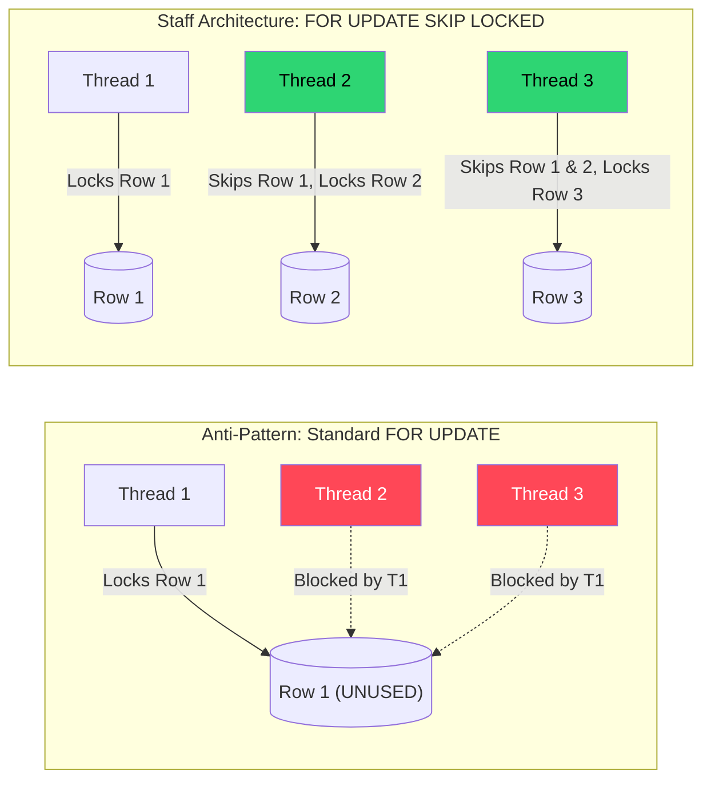

# 🧱 Engineering Brick: The Law of Non-Blocking Acquisition

> 🌸 *A hundred vessels seek the narrow gate,*
> *Where rigid locks command the flow to wait.*
> *Release the hold, let seeking currents glide,*
> *And watch the throughput swell the rising tide.*

## 🌠 1. The Formal Specification (Problem Model)

In [Part 1](), we established the *Law of Decoupled Computation*, moving heavy generation logic out of the critical path and into an Asynchronous Object Pool. The database now holds millions of pre-generated identifiers waiting to be consumed.

**The Workload & Constraints**:
* **The Task:** Thousands of concurrent API pods must fetch a single, unique `UNUSED` identifier from PostgreSQL, mark it as `PENDING`, and return it.
* **Throughput:** 10,000+ Requests Per Second (RPS).
* **The Anti-Pattern:** Using standard `UPDATE` or `SELECT ... FOR UPDATE` to claim the next available row.

---

## 🌪️ 2. What Breaks First at Scale (The Failure Mode)

A standard relational database operates on strict isolation and row-level locking. If 10,000 concurrent workers execute a standard `FOR UPDATE` query, the system experiences **Row-Level Lock Contention**. 

But to understand why the system collapses, a Principal Engineer does not guess; they calculate.

### 📊 2.1 Back-of-the-Envelope: The Mathematics of Collapse
Assume:
* Incoming Traffic: **10,000 concurrent requests/sec**.
* Lock Duration: Each transaction holds the lock for **~5ms** (network round-trip + DB commit time).

With strict row-level locking, the database forces requests to serialize.
$$\text{Effective Throughput} \approx \frac{1}{\text{Lock Duration}} = \frac{1}{0.005\text{s}} = \mathbf{200 \text{ ops/sec}}$$

The system can only process 200 RPS, but demand is 10,000 RPS. 
* **The Result:** The backlog grows at ~9,800 requests per second.
* **The Cascade:** Threads waiting for the database lock hold onto their application connection pool (e.g., HikariCP). A standard pool of 200 connections will dry up in exactly **0.02 seconds**. The API instantly returns `503 Service Unavailable`.

The system dies not from CPU or memory limits, but from contention.

---

## ⚡ 3. The Design Dialogue (Socratic Review)

*I simulate a design review with a Senior Engineer (The Challenger) to break down the "infrastructure expansion" myth.*

> **🕵️ The Challenger**: PostgreSQL is clearly not designed to be a message queue. We should deploy **Kafka** or **AWS SQS**! The background worker generates IDs, pushes them into Kafka, and the API pods just consume them lock-free.

**🧑‍💻 The Architect**:
Adding Kafka introduces a massive infrastructure tax for a simple state-transition problem. More importantly, Kafka is an immutable append-only log. What happens if an API pod consumes an ID from Kafka, starts processing, and crashes (OOM)? That ID is lost forever. 
**You are not solving concurrency. You are outsourcing it to another system—and paying for it twice.** We don't need a new broker; we just need to bypass the lock queue.

> **🕵️ The Challenger**: So we stay with Postgres. What if we use an Optimistic Lock with a `@Version` column? The pods read an ID, try to update it, and if it fails, they retry.

**🧑‍💻 The Architect**:
Optimistic Locking fails miserably under high concurrency. If 10,000 threads try to update the same row, 1 succeeds, and 9,999 throw an `OptimisticLockException`. They will all retry and hit the second row, resulting in 9,998 exceptions. You have just engineered a **Thundering Herd** that will DDoS your own database with retry queries. 

---

## 🌌 4. The Law of Non-Blocking Acquisition

To scale concurrent access to a shared data structure, we must obey a fundamental law of throughput:

> **If a resource is contended, do not wait. Advance immediately to the next available state.**

**Blocking is not a safety mechanism. It is a throughput killer disguised as correctness.** In a queueing model, waiting for a locked resource is a violation of throughput. If Thread A is looking at Row 1, Thread B should not politely stand behind it; Thread B should instantly skip to Row 2.

### 🗺️ 4.1 The Architectural Shift (Data Flow)



---

## 🧩 5. One Manifestation: The SKIP LOCKED Paradigm

PostgreSQL 9.5+ (and MySQL 8.0+) introduced a feature explicitly designed for this architecture: `FOR UPDATE SKIP LOCKED`. It instructs the engine to find matching rows, ignore any currently locked by other transactions, and return the next available ones.

### 🧱 5.1 The Hidden Bottleneck: Partial Indexing
Before writing the query, we must address the storage layer. Querying `WHERE status = 'UNUSED'` on a table with 100 million rows will result in a slow Sequential Scan. Creating a standard index on a low-cardinality boolean column is equally useless. 

**The Google-level Solution: Partial Indexes.**
```sql
CREATE INDEX idx_resource_unused 
ON resource_pool(id) 
WHERE status = 'UNUSED';
```
This index only contains rows that are actually available. As IDs are consumed, they are removed from this index. The B-Tree remains incredibly tiny, fits entirely in RAM, and yields blazing-fast scans.

### 🛠️ 5.2 The Core Skeleton (The Implementation)

```java
@Repository
public interface AllocationRepository extends JpaRepository<ResourceDescriptor, Long> {

    @Query(nativeQuery = true, value = """
        SELECT id FROM resource_pool 
        WHERE status = 'UNUSED' 
        LIMIT :chunkSize 
        FOR UPDATE SKIP LOCKED
    """)
    List<Long> acquireAvailableResourcesLockFree(@Param("chunkSize") int chunkSize);
}
```

---

## ☯️ 6. Production Realism & Trade-offs

A system is not production-ready until it handles failure, limits, and maintenance.

### 🔄 6.1 Lease & Recovery (Handling Pod Crashes)
**Problem:** What happens if a pod crashes (OOM) after claiming a row, but before processing it?
**Solution:** Do not mark it as permanently consumed. Introduce a **Stateful Lease**.
```sql
UPDATE resource_pool 
SET status = 'PENDING', leased_until = NOW() + INTERVAL '30 seconds' 
WHERE id = ?;
```
A background cron job constantly sweeps the pool for expired leases and resets them:
```sql
UPDATE resource_pool SET status = 'UNUSED', leased_until = NULL 
WHERE status = 'PENDING' AND leased_until < NOW();
```

### 🌐 6.2 Sharding the Pool (When the Single Table Breaks)
At extreme scale (e.g., 50,000+ RPS), even a partial index with `SKIP LOCKED` will suffer from page-latch contention. 
**Solution:** Hash partition the pool.
`shard_id = hash(pod_ip) % N`
Workers randomly select a shard and query within it, reducing index contention by $N$ times.

### 🧨 6.3 The Vacuum Tax & Starvation
* **Row Bloat:** Treating Postgres like a queue generates massive "Dead Tuples" due to MVCC. You must aggressively tune `autovacuum_vacuum_scale_factor` for this specific table.
* **Starvation:** `SKIP LOCKED` destroys FIFO ordering. Prioritizing throughput means some rows might be skipped frequently. For allocation systems, this is acceptable. For user-facing job scheduling, starvation must be mitigated.

---

## 📡 7. Observability Signals

A Staff Engineer always instruments the system. Monitor these critical golden signals:
* **Lock Wait Time:** (`pg_stat_activity`) Should be near zero. Alert if $> 50$ms.
* **Dead Tuple Ratio:** Monitor bloat to ensure Auto-Vacuum is keeping up.
* **Allocation Latency:** Track p99 to detect unexpected DB index degradation.
* **Pool Depletion Rate:** Alert when `UNUSED` pool drops below the 15-minute burn rate.

---

## ✨ 8. The "Brick" Summary (Mental Model)

When architecting concurrent dispatch systems, memorize this blueprint to prevent infrastructure bloat and lock contention.

* **🌠 Signal:** High concurrency threads fighting for the same available resources in a database, causing connection pool exhaustion or deadlock warnings.
* **🧩 Structure:** The Lock-Free Database Queue utilizing Partial Indexes and `SELECT ... FOR UPDATE SKIP LOCKED`.
* **🏛 Invariant:** A worker must never wait for a resource that is currently being evaluated by another worker.
* **💠 Pivot Insight:** The system does not scale when locks are optimized—it scales when locks are no longer part of the critical path. Repurpose the transactional safety of an RDBMS into an ultra-fast dispatch engine.

---
🪷 *One sentence to trigger the reflex:* **"Concurrency is not solved by adding systems — it is solved by removing waiting."**
