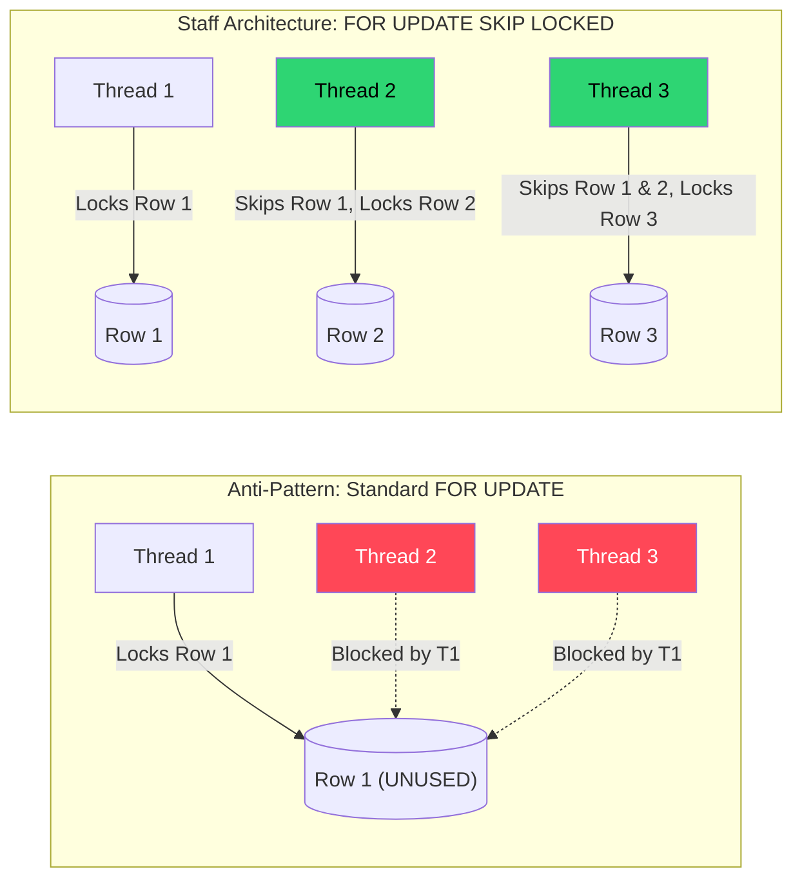

# 🧱 Engineering Brick: The Law of Non-Blocking Acquisition

> 🌸 *A hundred vessels seek the narrow gate,*
> *Where rigid locks command the flow to wait.*
> *Release the hold, let seeking currents glide,*
> *And watch the throughput swell the rising tide.*

## 🌠 1. The Formal Specification (Problem Model)

In [Part 1](), we established the *Law of Decoupled Computation*, moving heavy generation logic out of the critical path and into an Asynchronous Object Pool. The database now holds millions of pre-generated identifiers waiting to be consumed.

**The Workload & Constraints**:
* **The Task:** Thousands of concurrent API pods must fetch a single, unique `UNUSED` identifier from the PostgreSQL database, mark it as `PENDING`, and return it to the client.
* **Throughput:** 10,000+ Requests Per Second (RPS).
* **The Anti-Pattern:** Using standard `UPDATE` or `SELECT ... FOR UPDATE` to claim the next available row.

---

## 🌪️ 2. What Breaks First at Scale (The Failure Mode)

A standard relational database operates on strict isolation and row-level locking. If 10,000 concurrent workers execute:
`SELECT id FROM identifier_pool WHERE status = 'UNUSED' LIMIT 1 FOR UPDATE;`

The system will experience a catastrophic failure cascade known as **Row-Level Lock Contention**:

1. **The Funnel Effect:** All 10,000 threads scan the exact same database index and attempt to lock the *exact same first row*.
2. **Lock Queuing:** Thread 1 acquires the lock. Threads 2 through 10,000 are blocked by the database engine, forming a massive queue waiting for Thread 1 to commit.
3. **Connection Pool Exhaustion:** Because the threads are blocked waiting for the database, they hold onto their application-side connection pool (e.g., HikariCP). The pool dries up in milliseconds.
4. **Cascading API Outage:** New incoming API requests are rejected because no database connections are available. The system dies not from CPU or memory limits, but from contention.

---

## ⚡ 3. The Design Dialogue (Socratic Review)

*I simulate a design review with a Senior Engineer (The Challenger) to break down the "infrastructure expansion" myth.*

> **🕵️ The Challenger**: PostgreSQL is clearly not designed to be a message queue. We should deploy **Kafka** or **AWS SQS**! The background worker generates IDs, pushes them into Kafka, and the API pods just consume them lock-free.

**🧑‍💻 The Architect**:
Adding Kafka introduces a massive infrastructure tax for a simple state-transition problem. More importantly, Kafka is an immutable append-only log. What happens if an API pod consumes an ID from Kafka, starts processing, and crashes (OOM)? That ID is lost forever.
We need a *Stateful Lease*—the ability to reclaim an ID if the consumer dies. Relational databases are exceptional at state management. We don't need a new broker; we just need to bypass the lock queue.

> **🕵️ The Challenger**: So we stay with Postgres. What if we use an Optimistic Lock with a `@Version` column? The pods read an ID, try to update it, and if it fails, they retry.

**🧑‍💻 The Architect**:
Optimistic Locking fails miserably under high concurrency. If 10,000 threads try to update the same row, 1 succeeds, and 9,999 throw an `OptimisticLockException`. They will all retry and hit the second row, resulting in 9,998 exceptions. You have just engineered a **Thundering Herd** that will DDoS your own database with retry queries.

---

## 🌌 4. The Law of Non-Blocking Acquisition

To scale concurrent access to a shared data structure, we must obey a fundamental law of throughput:

> **If a resource is contended, do not wait. Advance immediately to the next available state.**

In a queueing model, waiting for a locked resource is a violation of throughput. If Thread A is looking at Row 1, Thread B should not politely stand behind it; Thread B should instantly skip to Row 2.

### 🗺️ 4.1 The Architectural Shift (Data Flow)



---

## 🧩 5. One Manifestation: The SKIP LOCKED Paradigm

PostgreSQL 9.5+ (and MySQL 8.0+) introduced a feature explicitly designed for this exact architecture: `FOR UPDATE SKIP LOCKED`.

It instructs the database engine: *"Find me the rows that match my criteria. If any of those rows are currently locked by another transaction, pretend they do not exist and give me the next available ones."*

### 🛠️ 5.1 The Core Skeleton (The Implementation)

By combining Spring Data JPA (or any ORM) with a native query, we turn PostgreSQL into a highly concurrent, lock-free dispatch engine.

```java
@Repository
public interface AllocationRepository extends JpaRepository<ResourceDescriptor, Long> {

    /**
     * The Pivot Insight: Treating PostgreSQL as a Concurrent Work Queue.
     * SKIP LOCKED allows thousands of threads to fetch distinct batches
     * without blocking each other.
     */
    @Query(nativeQuery = true, value = """
        SELECT id FROM resource_pool
        WHERE status = 'UNUSED'
        LIMIT :chunkSize
        FOR UPDATE SKIP LOCKED
    """)
    List<Long> acquireAvailableResourcesLockFree(@Param("chunkSize") int chunkSize);
}
```

```java
@Service
@RequiredArgsConstructor
public class HighConcurrencyAllocationService {

    private final AllocationRepository repository;

    @Transactional
    public String allocate() {
        // Threads execute this concurrently. No waiting. No OptimisticLockExceptions.
        List<Long> claimedIds = repository.acquireAvailableResourcesLockFree(1);

        if (claimedIds.isEmpty()) {
            throw new ResourceExhaustionException("Pool is empty or heavily contended.");
        }

        ResourceDescriptor asset = repository.findById(claimedIds.get(0)).orElseThrow();
        asset.markAsPending(); // Safe to mutate: we hold an exclusive lock on THIS specific row

        return asset.getIdentifierValue();
    }
}
```

---

## ☯️ 6. Production Realism & Trade-offs

A Principal Engineer knows that `SKIP LOCKED` is magic, but magic has a price.

### 🧨 6.1 The Destruction of Strict FIFO
`SKIP LOCKED` fundamentally destroys First-In-First-Out (FIFO) ordering. Because transactions commit at different speeds, newer rows might be claimed and processed before older, locked rows finish.
* **Decision:** For allocation pools (like unique IDs), order does not matter. If you are building a strict financial ledger where Event A *must* be processed before Event B, you **cannot** use `SKIP LOCKED`.

### 🧨 6.2 The PostgreSQL Vacuum Tax (Row Bloat)
Treating a relational table like a queue means you are executing thousands of `UPDATE` statements per second. In PostgreSQL's MVCC architecture, an `UPDATE` is actually a `DELETE` + `INSERT`. This generates a massive amount of "Dead Tuples".
* **The Mitigation:** If you use this pattern at scale, you must aggressively tune PostgreSQL's Auto-Vacuum settings for this specific table (e.g., lowering `autovacuum_vacuum_scale_factor`), otherwise, the table will bloat, degrading index performance over time.

---

## ✨ 7. The "Brick" Summary (Mental Model)

When architecting concurrent dispatch systems, memorize this blueprint to prevent infrastructure bloat and lock contention.

* **🌠 Signal:** High concurrency threads fighting for the same available resources in a database, causing connection pool exhaustion or deadlock warnings.
* **🧩 Structure:** The Lock-Free Database Queue utilizing `SELECT ... FOR UPDATE SKIP LOCKED`.
* **🏛 Invariant:** A worker must never wait for a resource that is currently being evaluated by another worker.
* **💠 Pivot Insight:** Do not over-engineer with external Message Brokers just to achieve concurrency. By adopting the Law of Non-Blocking Acquisition, you can repurpose the transactional safety of a Relational Database into an ultra-fast, concurrent dispatch engine.

---
🪷 *One sentence to trigger the reflex:* **"Do not wait in line for a locked door; skip to the next open room and claim the space."**
