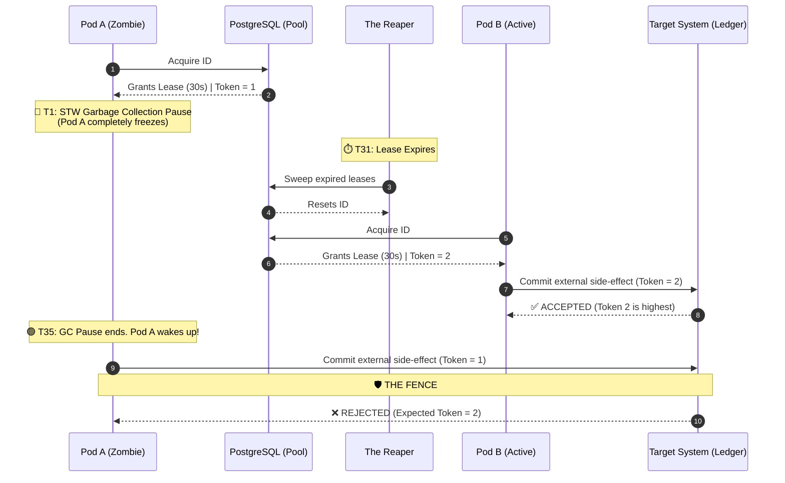

# 🧱 Engineering Brick: The Law of Temporal Ownership

> 🌸 *The worker falls, the claim remains,*
> *A phantom lock in silent chains.*
> *Trust not the thread, but trust the glass,*
> *And sweep the dead when moments pass.*

## 🌠 1. The Formal Specification (Problem Model)

In [Part 2](), we successfully eliminated database lock contention using the `SKIP LOCKED` paradigm. Our system can now dispatch 10,000+ IDs per second across thousands of concurrent API pods.

However, we engineered for *speed*, not for *disaster*. 

**The Workload & Constraints**:
* **The Task:** A Pod claims an `UNUSED` ID, transitions it to `PENDING`, performs external logic (e.g., calling a third-party payment gateway), and finally marks it as `CONSUMED`.
* **The Reality:** Distributed nodes are ephemeral. They crash, they disconnect, and they freeze.

---

## 🌪️ 2. What Breaks First at Scale (The Failure Mode)

In a distributed environment, a Pod will inevitably claim an ID and then violently die (OOMKilled, Hardware Failure, or Node Eviction) before it can finish its task. 

1. **The Leakage:** Every time a Pod dies, an ID is permanently orphaned in the `PENDING` state. 
2. **Pool Depletion:** Over time, the pool empties not because IDs are being consumed, but because they are leaking. This is the **Zombie Resource** crisis.

---

## ⚡ 3. The Design Dialogue (Socratic Review)

*I simulate a design review with a Senior Engineer (The Challenger) to break down the "Heartbeat" myth.*

> **🕵️ The Challenger**: Let's implement a **Heartbeat**. The Pod pings a registry every 5 seconds. If the ping stops, we reclaim its IDs.

**🧑‍💻 The Architect**:
Heartbeats tell you if the network path is alive, not if the application is functioning. What if a node experiences a network partition? It is still alive, still processing, but its heartbeat cannot reach the registry. Reclaiming the ID here creates a **Split-Brain** double-allocation. 

**Do not wait for a node to tell you it has died. Let its silence be its expiration.** We do not need heartbeats; we need Temporal Ownership.

---

## 🏛️ 4. The State Model (Schema)

Before implementing the logic, we must define the **Source of Truth**. Our allocation pool requires specific metadata columns to support non-blocking acquisition and distributed safety.

```sql
CREATE TABLE resource_pool (
    id            BIGSERIAL PRIMARY KEY,
    identifier    VARCHAR(255) UNIQUE NOT NULL,
    status        VARCHAR(20) DEFAULT 'UNUSED', -- UNUSED, PENDING, CONSUMED
    leased_until  TIMESTAMP WITH TIME ZONE,     -- The temporal wall
    lease_token   BIGINT DEFAULT 0,             -- The Monotonic Fencing Token
    updated_at    TIMESTAMP WITH TIME ZONE DEFAULT NOW()
);

-- Partial Index for high-speed SKIP LOCKED scans
CREATE INDEX idx_resource_unused 
ON resource_pool(id) 
WHERE status = 'UNUSED';
```

---

## 🌌 5. The Law of Temporal Ownership

In distributed systems, indefinite state transitions are indistinguishable from permanent failures. 

> **In distributed systems, ownership is not a fact — it is a lease validated by time and version.**

If a worker needs a resource, it borrows it for a strict, unforgiving time window.

### 🛠️ 5.1 The Implementation: Acquisition & The Reaper

We modify our lock-free allocation query to grant a **Stateful Lease** and increment the **Fencing Token**:

```sql
-- 1. The Acquisition (Granting the Lease)
UPDATE resource_pool 
SET status = 'PENDING', 
    leased_until = NOW() + INTERVAL '30 seconds',
    lease_token = lease_token + 1 
    -- CRITICAL: lease_token MUST remain strictly monotonic and must never be reset,
    -- even during reclaim, otherwise fencing guarantees break.
WHERE id IN (
    SELECT id FROM resource_pool 
    WHERE status = 'UNUSED' 
    LIMIT 1 FOR UPDATE SKIP LOCKED
)
RETURNING id, lease_token;
```

We then introduce **The Reaper**—a background daemon that scans for expired leases and resets them to the pool:

```sql
-- 2. The Reaper (Reclaiming the Dead)
UPDATE resource_pool 
SET status = 'UNUSED', leased_until = NULL 
WHERE status = 'PENDING' AND leased_until < NOW();
```

> **Note on Race Conditions:** In high-contention systems, the Reaper may race with active workers. Advanced teams process reclaims in small batches and add token guards to avoid reclaiming resources that are milliseconds away from completing.

---

## ☯️ 6. Production Edge Cases (The Principal's Domain)

### 🧨 6.1 The Resurrection Anomaly (GC Pauses)
Consider this terrifying sequence of events:
1. **T0:** Pod A acquires ID #42 with a 30s lease.
2. **T1:** Pod A's JVM triggers a **"Stop-The-World" Garbage Collection pause**. The thread freezes entirely.
3. **T31:** The lease expires. The Reaper resets ID #42 to `UNUSED`.
4. **T32:** Pod B acquires ID #42.
5. **T35:** Pod A's GC pause ends. It wakes up, completely unaware it was asleep. Both Pod A and Pod B now think they own ID #42. 

### 🧱 6.2 The Fix: Fencing Tokens & Enforcement
To survive a resurrected zombie, we must implement **Fencing**. 

**The Rule:** Enforcement **MUST** be at the system of record. If you check the token only in the application layer, the protection is meaningless because a GC pause can happen *after* the check but *before* the write.

#### 🗺️ 6.2.1 The Timeline of a Resurrection (Sequence Diagram)



```sql
-- The Final Commit (Fenced at the System of Record)
UPDATE business_ledger 
SET status = 'COMPLETED'
WHERE resource_id = 42 
  AND expected_lease_token = :token_from_step_5_1;
```

### ⚖️ 6.3 Lease Duration & Renewal
Lease duration is a balance of "Hòa Khí" (Equilibrium):

* **Short Leases (e.g., 5s):** Fast failure recovery, but high risk of "false reclaims" due to network jitter or minor GC pauses.
* **Long Leases (e.g., 5m):** Safer for heavy tasks, but a real failure "freezes" the resource for 5 minutes, killing throughput.
* **Lease Renewal:** For long-running tasks, workers may renew leases before expiry. Renewal must preserve fencing guarantees (e.g., monotonic token validation), otherwise it reintroduces split-brain risks.

### 🧨 6.4 Clock Drift & Idempotency
* **Clock Drift:** Never use application-side time (`System.currentTimeMillis()`). The database is the only clock that matters. Always use `NOW()`.
* **Idempotency:** Fencing enforces ordering. Idempotency enforces uniqueness. In production systems, you almost always need both. Combine fencing with Idempotency Keys (e.g., `request_id`) as a final safety layer against duplicate external side-effects.

### 🏛️ 6.5 The Global Invariant
To bind this architecture together, we must strictly enforce this rule: **At any point in time, only the holder of the highest fencing token recognized by the system of record is allowed to finalize state transitions.**

---

## 🗝 7. The "Brick" Summary (Mental Model)

* **🌠 Signal:** Workers hanging or crashing, leading to stuck `PENDING` states or double-processing.
* **🧩 Structure:** Stateful Lease + Background Reaper + Monotonic Fencing Tokens.
* **🏛️ Invariant:** Ownership is temporary and revocable. Enforcement must happen at the destination.
* **💠 Pivot Insight:** Distributed systems fail not when workers crash, but when ownership is assumed instead of continuously validated.

---
🪷 *One sentence to trigger the reflex:* **"Ownership is not held — it is continuously proven."**
