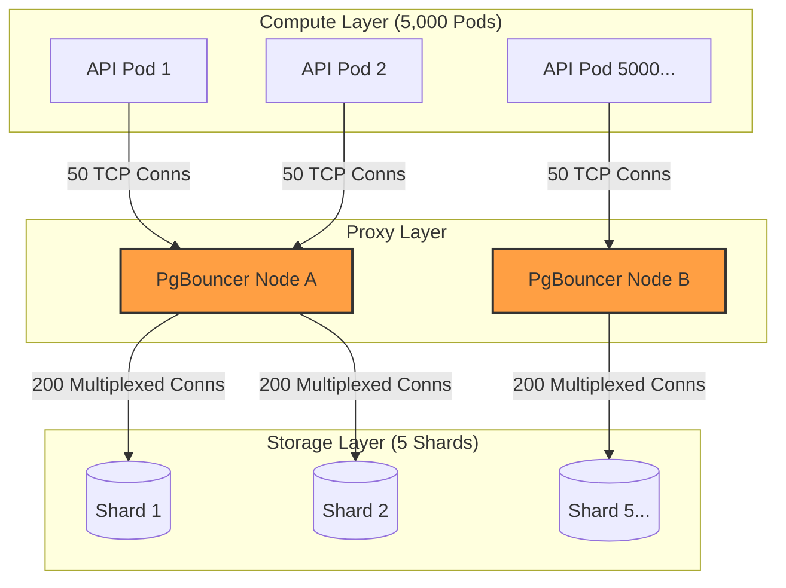

# 🧱 Engineering Brick: The Law of Fragmented State

> 🌸 *The vessel cracks beneath the rising sea,*
> *So split the stream and let the waters flee.*
> *But guard the gates where thousand threads align,*
> *Or drown the shards before they ever shine.*

## 🌠 1. The Formal Specification (Problem Model)

In [Part 3](), we perfected our allocation queue using `SKIP LOCKED`, Stateful Leases, and Fencing Tokens. The system is structurally flawless.

However, software runs on hardware.

**The Workload & Constraints**:
* **The Task:** Dispatch IDs to thousands of concurrent API Pods.
* **The Limit:** A single monolithic PostgreSQL instance (even highly tuned) hits a physical ceiling. The Write-Ahead Log (WAL) maxes out the SSD's IOPS, and index page-latch contention destroys CPU efficiency at around **40,000 RPS**.
* **The Requirement:** We must scale horizontally to **200,000+ RPS** by partitioning the database (Sharding).

---

## 🌪️ 2. The Naive Shard & The Failure Mode

The standard architectural response to hitting a database ceiling is Hash Partitioning. We spin up 5 PostgreSQL instances (Shards).

When an API Pod needs an ID, it randomly selects one of the 5 Shards and executes our `SKIP LOCKED` query. If Shard 1 is empty, it tries Shard 2.

### 📊 2.1 The Mathematics of a Connection Collapse
Sharding divides data, but **it multiplies connections**. PostgreSQL uses a process-per-connection model. Every active connection consumes roughly ~10MB of RAM.

Assume you have a large Kubernetes cluster:
* **API Pods:** $5,000$ pods.
* **Connection Pool (HikariCP):** Minimum $10$ connections per pod per shard to maintain throughput.
* **Shards:** $5$ database nodes.

If every pod connects directly to every shard:
$$\text{Total Connections per Shard} = 5,000 \times 10 = \mathbf{50,000 \text{ connections}}$$

50,000 connections require **~500GB of RAM just to keep the idle connections open**, before processing a single byte of data. PostgreSQL will immediately trigger the OOM Killer or reject connections with `FATAL: sorry, too many clients already`.

**The system dies not from data volume, but from connection exhaustion.**

---

## ⚡ 3. The Design Dialogue (Socratic Review)

*I simulate a design review with a Senior Engineer (The Challenger) to break down the sharding illusion.*

> **🕵️ The Challenger**: If connections are the problem, we should just lower the HikariCP pool size in our Java apps to 1 connection per shard. Problem solved!

**🧑‍💻 The Architect**:
If you drop the connection pool to 1, you completely destroy the concurrent throughput of the Pod. Threads inside the Pod will now block each other waiting for that single database connection. You have moved the bottleneck from the database RAM to the application thread pool.
**You cannot solve a fan-out connection problem by starving your compute layer.** We need a multiplexer.

> **🕵️ The Challenger**: Okay, what if we use a central message broker like Kafka to route requests to the shards?

**🧑‍💻 The Architect**:
We explicitly avoided Kafka in Part 2 to prevent split-brain issues and infrastructure bloat. We do not need an asynchronous log; we need an L4/L7 Connection Proxy.

---

## 🌌 4. The Architectural Shift: Connection Multiplexing

To scale a sharded relational database to thousands of microservices, you must insert a **Connection Multiplexer** (e.g., PgBouncer, Envoy, or a dedicated Data API layer).

### 🗺️ 4.1 The Multiplexed Topology

The API Pods maintain large connection pools to PgBouncer. PgBouncer maintains a small, highly active, and shared pool of connections to PostgreSQL. It routes queries instantly, saving the database from connection RAM overhead.

---

## 🧩 5. Intelligent Routing: The Power of Two Choices

When you shard a pool of available IDs, the distribution is never perfectly even.
* Shard 1 might be completely depleted of `UNUSED` IDs.
* Shard 2 might have millions.

If a worker randomly picks a shard, it might hit Shard 1, get zero IDs, and have to retry, wasting network round-trips. If it broadcasts to *all* shards, it creates a distributed DDoS attack.

**The Principal Solution: The Power of Two Choices.**
Instead of picking 1 random shard or querying all of them, the worker:
1. Randomly selects exactly **two** shards.
2. Pings them for their current `pg_stat_activity` queue depth (or relies on localized caching/metrics).
3. Executes the `SKIP LOCKED` acquisition on the shard that appears healthier or more populated.

This algorithm mathematically guarantees near-optimal load balancing without the extreme overhead of global consensus.

---

## 🧱 6. The Global Fencing Integrity

Does sharding break the Fencing Tokens we built in Part 3?
**No.** Our global invariant stated: *Only the holder of the highest fencing token recognized by the system of record is allowed to finalize state transitions.*

Because the `lease_token` is attached to the specific row of the `resource_pool`, and that specific row lives on exactly one shard, the monotonicity of the token is perfectly preserved. The target ledger only cares about the token provided, not which shard generated it.

---

## ✨ 7. The "Brick" Summary (Mental Model)

* **🌠 Signal:** Database hitting max connections, OOM Killer active, or high lock-wait times despite using `SKIP LOCKED`.
* **🧩 Structure:** Hash Partitioned Shards + Connection Multiplexer (PgBouncer) + The Power of Two Choices routing.
* **🏛 Invariant:** Application threads must never connect directly to a heavily sharded database architecture at scale.
* **💠 Pivot Insight:** Sharding does not just divide your data; it acts as a massive multiplier for your connection topology. You must protect the database's connection pool before you distribute the data.

---
🪷 *One sentence to trigger the reflex:* **"Sharding does not divide your problems; it distributes them. Proxy the connections before you split the data."**
