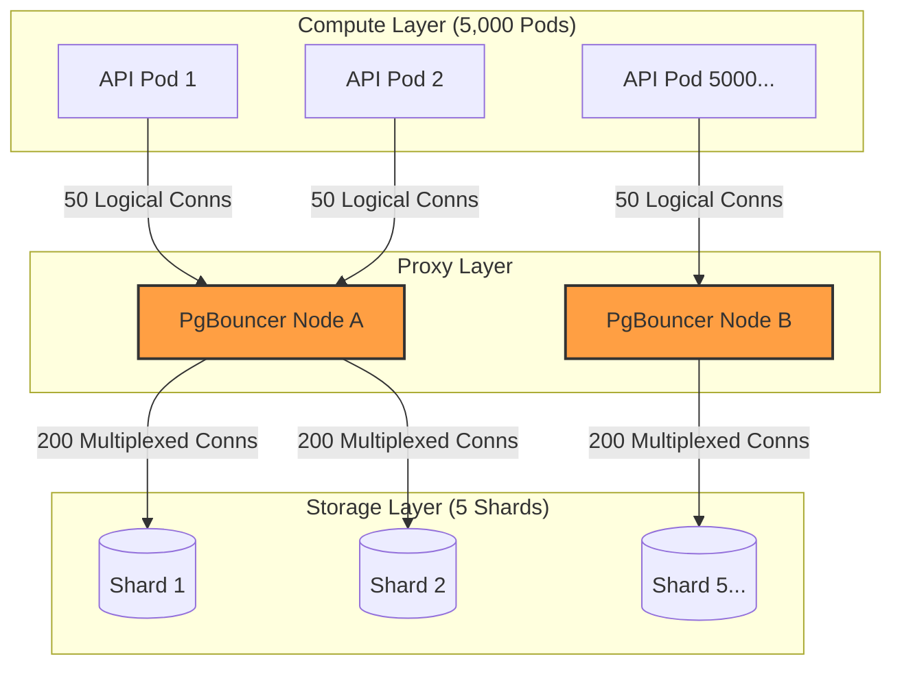

# 🧱 Engineering Brick: The Law of Fragmented State

> 🌸 *The vessel cracks beneath the rising sea,*
> *So split the stream and let the waters flee.*
> *But guard the gates where thousand threads align,*
> *Or drown the shards before they ever shine.*

## 🌠 1. The Formal Specification (Problem Model)

In [Part 3](), we perfected our allocation queue using `SKIP LOCKED`, Stateful Leases, and Fencing Tokens. The system is structurally flawless and guarantees correctness under catastrophic failures.

However, software runs on hardware. 

**The Workload & Constraints**:
* **The Task:** Dispatch IDs to thousands of concurrent API Pods.
* **The Limit:** A single monolithic PostgreSQL instance (even highly tuned) hits a physical ceiling. The Write-Ahead Log (WAL) maxes out the SSD's IOPS, and index page-latch contention destroys CPU efficiency at around **40,000 RPS**.
* **The Requirement:** We must scale horizontally to **200,000+ RPS** by partitioning the database (Sharding).

---

## 🌪️ 2. The Naive Shard & The Failure Mode

The standard architectural response to hitting a database ceiling is Hash Partitioning. We spin up 5 PostgreSQL instances (Shards). 

When an API Pod needs an ID, it selects a Shard and executes our `SKIP LOCKED` query.

### 📊 2.1 The Mathematics of a Connection Collapse
Sharding divides data, but **it multiplies the topology**. PostgreSQL uses a strict process-per-connection model. 

Assume you have a large Kubernetes cluster:
* **API Pods:** 5,000 pods.
* **Shards:** 5 database nodes.
* **Topology Demand:** Without multiplexing, a pod that needs effective access to 5 shards often forces the topology toward 50 live upstream client connections in aggregate (e.g., a pool of 10 per shard).

If every pod connects directly to every shard, the math is brutal:
5,000 pods * 10 connections = **50,000 logical connections per shard.**

This scale can imply **hundreds of gigabytes of memory overhead** in the worst case, just to keep idle connections open before processing a single byte of data. PostgreSQL will immediately trigger the OOM Killer or reject connections with `FATAL: sorry, too many clients already`.

**The system dies not from data volume, but from connection exhaustion.**

---

## ⚡ 3. The Design Dialogue (Socratic Review)

*I simulate a design review with a Senior Engineer (The Challenger) to break down the sharding illusion.*

> **🕵️ The Challenger**: If connections are the problem, we should just lower the HikariCP pool size in our Java apps to 1 connection per shard. Problem solved!

**🧑‍💻 The Architect**:
If you drop the connection pool to 1, you completely destroy the concurrent throughput of the Pod. Threads inside the Pod will now block each other waiting for that single database connection. You have moved the bottleneck from the database RAM to the application thread pool. 
**You cannot solve a fan-out connection problem by starving your compute layer.** We need a multiplexer.

> **🕵️ The Challenger**: Okay, what if we use a central message broker like Kafka to route requests to the shards?

**🧑‍💻 The Architect**:
We explicitly avoided Kafka in Part 2 to prevent split-brain issues and infrastructure bloat. We do not need an asynchronous log; we need an L4/L7 Connection Proxy. 

---

## 🌌 4. The Architectural Shift: Connection Multiplexing

To scale a sharded relational database to thousands of microservices, you must insert a **Connection Multiplexer** (e.g., PgBouncer, Envoy, or a dedicated Data Access Layer).

### 🗺️ 4.1 The Multiplexed Topology

> **The Principal Doctrine:** Horizontal scale is not achieved when data is split. It is achieved when coordination cost grows slower than load.

---

## 🧩 5. Intelligent Routing: The Power of Two Choices

When you shard a pool of available IDs, the distribution is never perfectly even.
If a worker randomly picks a shard, it might hit an empty one, wasting network round-trips. If it broadcasts to *all* shards, it creates a distributed DDoS attack.

**The Solution: The Power of Two Choices.**
Instead of picking 1 random shard or querying all of them, the worker selects exactly **two** random shards and routes the request to the one that appears healthier.

Workers should not query live metadata (like `pg_stat_activity`) on every request. In practice, the decision is driven by **cached health signals, lightweight shard occupancy counters, or periodically refreshed local metrics.** This algorithm mathematically guarantees near-optimal load balancing without the extreme overhead of global consensus.

---

## 🧱 6. System Integrity Boundaries

### 🛡️ 6.1 The Fencing Truth After Sharding
Does sharding break the Fencing Tokens we built in Part 3?
No, but it redefines their scope. **Sharding does not preserve a global order of tokens across the fleet; it preserves monotonic truth for each resource at its authoritative shard.**
Because the `lease_token` is attached to a specific row, and that row lives on exactly one shard, the target ledger only needs to validate the monotonic progression of that specific resource.

### ⚠️ 6.2 The Limits of Multiplexing (When Proxies Fail)
PgBouncer is not magic. Introducing transaction-level multiplexing comes with strict boundaries:
* Long-running transactions severely weaken pooling efficiency.
* Transaction pooling breaks session-dependent features.
* Prepared statements, temporary tables, and session state (`SET session_replication_role...`) can heavily constrain proxy modes and require complex workarounds.

---

## 🏛 7. The Global Invariant

**Application threads should not fan out directly across a heavily sharded topology at scale; a multiplexing or data-access control layer becomes mandatory.**

---

## ✨ 8. The "Brick" Summary (Mental Model)

* **🌠 Signal:** Database hitting max connections, OOM Killer active, or high lock-wait times despite using `SKIP LOCKED`.
* **🧩 Structure:** Hash Partitioned Shards + Connection Multiplexer + Power of Two Choices routing.
* **🏛 Invariant:** Monotonicity is per-resource at the authoritative shard. Compute fan-out must be proxy-terminated.
* **💠 Pivot Insight:** Sharding multiplies your failure surface and routing complexity. You must protect the database's connection pool before you distribute the data.

---
🪷 *One sentence to trigger the reflex:* **"Sharding does not divide your problems; it distributes them. Proxy the connections before you split the data."**
