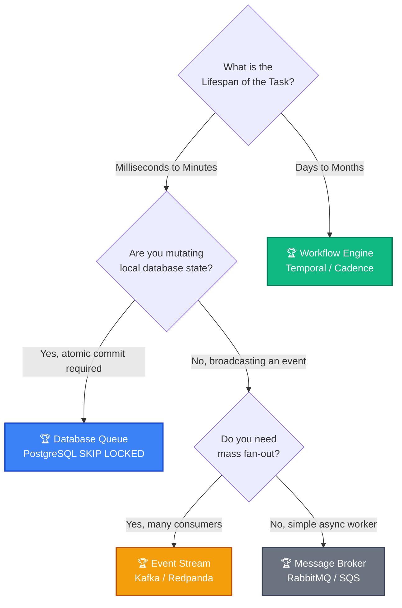

# 🧱 Engineering Brick: The Law of Asynchronous Truth

> 🌸 *The river runs where events are thrown,*
> *The vault secures what state is known.*
> *The clock will watch the sleeping thread,*
> *Choose well the ground where you will tread.*

## 🌠 1. The Ideological War & The Core Confusion

Across our four-part journey, we transformed PostgreSQL from a locking bottleneck into a high-throughput, partitioned allocation engine capable of hundreds of thousands of requests per second. 

Inevitably, someone will look at this architecture and say: *"Why didn't you just use Kafka?"*

This stems from a fundamental misunderstanding of asynchronous architecture. Teams do not usually fail because they lack tools. They fail because they ask the same tool to behave like:
* a transactional state machine,
* a historical log,
* and a durable workflow engine
*at the exact same time.*

> **🕵️ The Challenger:** Why not just standardize on Kafka and use it for everything?
> 
> **🧑‍💻 The Architect:** Because tools do not fail when they are weak. They fail when we force them to hold the wrong kind of truth.

---

## 🏛️ 2. The Four Architectural Pillars

To build a decision framework, we must define the exact boundary conditions where each technology reigns supreme—and where it catastrophically fails.

### 🗄️ 2.1 The Database Queue (PostgreSQL / MySQL)
We use a database as a queue (via `SKIP LOCKED`) when task acquisition and business state mutation must be committed under the same transactional authority.

* **The Core Strength:** Absolute ACID compliance. You can claim an ID, deduct a balance, and mark an invoice as paid within a single atomic `COMMIT`.
* **The Failure Mode:** Polling overhead and connection topology limits (as solved in Part 4).
* **When to use:** When "Allocating the task" and "Updating the business state" are the exact same operation.

### 🌊 2.2 The Event Stream (Kafka / Redpanda)
Kafka is an immutable append-only log. It is designed for **event notification and mass fan-out**, not state management.

* **The Core Strength:** Infinite replayability and decoupled consumer fan-out. One event (`OrderCreated`) can trigger 50 different microservices asynchronously.
* **The Fatal Trap (The Dual-Write Problem):** You cannot update a database and publish to Kafka in a single transaction. If your database commits but the Kafka publish fails, your system is permanently out of sync. You are forced to implement the Transactional Outbox Pattern, which means **you are reintroducing a database-backed coordination layer anyway.**
* **When to use:** When the source of truth has already been safely committed locally, and you need to broadcast the *fact* that it happened.

### 🌀 2.3 The Workflow Engine (Temporal / AWS Step Functions)
Workflow engines do not care about raw throughput; they care about **time and distributed durability**.

* **The Core Strength:** Pausing execution state. You can write code that says `await sleep(30 days)` and the engine will suspend the state to disk, surviving pod crashes and cluster reboots. It handles retries and Saga compensations natively.
* **The Boundary Limit:** Workflow engines are not a substitute for a high-throughput dispatch queue. They trade raw throughput for durable execution state and orchestration semantics.
* **When to use:** When your business logic spans multiple microservices, requires compensating transactions (Sagas), or waits for human interaction over long periods.

### 📨 2.4 The Message Broker (RabbitMQ / SQS)
Often caught in the crossfire between DBs and Kafka, message brokers act as ephemeral post offices.

* **The Core Strength:** Lightweight asynchronous delivery and routing without the heavy infrastructure of an event stream.
* **The Boundary Limit:** A broker is not the system of record. Its job is delivery, not durable business truth or replay-heavy history.
* **When to use:** Simple, decoupled background work without the need for workflow durability or replay-heavy event streaming.

---

## 🧭 3. The Principal's Decision Framework

### 👁️ 3.1 The Real Question
Teams often ask: *"Which tool is better?"*

That is the wrong question. The real questions are:
* Where does truth live?
* How long must unfinished state survive?
* What must be atomic?
* Who is allowed to replay?

### 🗺️ 3.2 The Decision Tree

---

## ⚡ 4. The Architectural Doctrine

**The mistake is not choosing the wrong tool. The mistake is asking one tool to impersonate another.**

If you take away only one lesson from this entire series, let it be this:
* **Atomic truth lives in the Database.**
* **Historical truth belongs in the Log.**
* **Unfinished truth must be carried by the Workflow.**

---

## ✨ 5. The "Brick" Summary (Mental Model)

* **🌠 Signal:** Team arguing over "Kafka vs. Postgres" or struggling with Outbox patterns and dual-write inconsistencies.
* **🧩 Structure:** State Machine (DB) vs. Immutable Log (Kafka) vs. State Suspension (Temporal) vs. Ephemeral Delivery (RabbitMQ).
* **🏛 Invariant:** Never use an Event Stream to mimic a transactional State Machine without explicit compensation protocols.
* **💠 Pivot Insight:** Tools do not dictate architectures; state boundaries do. Map the lifespan and transactional scope of your task before writing a single line of infrastructure-as-code.

---

## 🏆 Epilogue: From Contention to Throughput

Over these five chapters, we have dismantled the anatomy of high-throughput allocation systems:
* **Part 1:** We moved work out of the critical path.
* **Part 2:** We removed waiting by embracing lock-free acquisition (`SKIP LOCKED`).
* **Part 3:** We validated temporal ownership with Fencing Tokens.
* **Part 4:** We contained topological explosion through connection multiplexing and sharded routing.
* **Part 5:** We defined the boundaries of asynchronous truth.

🪷 *One sentence to trigger the reflex:* **"Define the state lifespan first, then buy the tool."**
