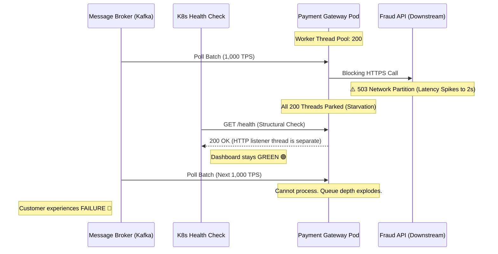

# 🧱 Engineering Brick: The Illusion of Structural Health

> 🌸 *The dashboard glows a peaceful green,*
> *While silent death chokes the machine.*
> *A beating heart with frozen veins,*
> *Where metrics lie and ruin reigns.*

## 🌠 1. The Context & The Symptom

In modern cloud-native architectures, we design under the assumption that components will fail. We deploy orchestrators like Kubernetes to restart crashed pods and rely on message brokers to buffer data during outages. But what happens when a component refuses to die?

Imagine it is a Friday afternoon. Your monitoring dashboard is a sea of green. Kubernetes reports 100% pod health. CPU and Memory usage are comfortably low—almost idle. Yet, your PagerDuty is screaming about payment timeouts, and the unsettled transaction queue is skyrocketing. 

This is the **Observability Mirage**: a state where your infrastructure metrics claim "Life" while your business logic is undergoing "Brain Death." 

---

## 🧩 2. The Formal Specification (Problem Model)

To dissect this failure, we must first isolate the physical boundaries and the state model of the system.

**The Workload & Constraints:**
* **The Domain:** A high-throughput Payment Gateway.
* **The Task:** Ingest transaction events from an asynchronous message broker (e.g., Kafka) and evaluate them against a synchronous Third-Party Fraud Detection API before authorization.
* **The Constraint:** Bridging an unbounded asynchronous ingestion pipeline with a strictly bounded, blocking HTTP call over a finite worker thread pool.
* **The Invariants:** `Processing_Time < Timeout_Threshold` and `Throughput >= Ingestion_Rate`.

---

## 🌪️ 3. The Anatomy of the Freeze (Failure Mode)

The failure originated from a classic architectural misalignment: embedding blocking I/O inside a highly concurrent event-driven loop.

### 📊 3.1 The Topological Collapse

### ⚡ 3.2 Semantic vs. Structural Health
When the Fraud API latency spiked, the worker threads were "parked" waiting for an I/O response. Because they were merely waiting, CPU usage plummeted to near zero. The JVM remained active, the PID existed, and the isolated management thread serving the `/health` endpoint happily returned `HTTP 200 OK`.

Kubernetes, utilizing a **Structural Health Check**, saw a running process and did nothing. The pod became a **Zombie**—alive to the orchestrator, but entirely dead to the business.

---

## ⚖️ 4. The Quantitative Mandate (Math Beats Opinions)

Post-mortems often rely on vague terms like "the system slowed down." At the Staff level, we must quantify the exact physics of the collapse. Let us calculate the **Time-to-Paralysis (TTP)**.

* **Ingestion Rate (R):** 1,000 Transactions Per Second (TPS).
* **Thread Pool Size (N):** 200 Threads.
* **Normal API Latency (L_normal):** 100ms (0.1s).
* **Failure API Latency (L_failure):** 2,000ms (2.0s).

Under normal conditions, the maximum theoretical capacity is healthy:
`Capacity = N / L_normal = 200 / 0.1 = 2,000 TPS`. (We have a 2x safety margin).

When the downstream API degrades to 2 seconds, the capacity violently collapses:
`Collapsed_Capacity = N / L_failure = 200 / 2.0 = 100 TPS`.

Because we are still ingesting at 1,000 TPS, we are accumulating a deficit of 900 tasks per second. The entire thread pool will be **completely exhausted** in:
`TTP = N / Deficit = 200 / 900 ≈ 0.22 seconds`.

> *Note: This is a first-order saturation estimate, not an exact queueing-theory model, but it is strictly sufficient to prove that the collapse happens in sub-second time.*

**The Blast Radius:**
In less than a quarter of a second, the system is paralyzed. If your Liveness Probe interval is 30 seconds, you have a 30-second window of total blindness. In that window, `1,000 TPS * 30s = 30,000` payments are stuck. At an average of 50 USD per transaction, **the Revenue at Risk is $1.5M per incident window**, all while the dashboard shines a brilliant green.

---

## 🔬 5. The Design Dialogue (Socratic Review)

> **🕵️ The Challenger**: If thread exhaustion is the issue, why doesn't Kubernetes Auto-scaling (HPA) save us? If the queue depth rises, HPA should spin up more pods to handle the load.

**🧑‍💻 The Architect**:
Scaling a paralyzed system merely scales the paralysis. If HPA spins up 10 new pods, they will immediately consume the backlogged messages, hit the exact same degraded Fraud API, and their thread pools will also exhaust in 0.22 seconds. **You cannot auto-scale your way out of a downstream bottleneck.**

> **🕵️ The Challenger**: Then the architecture is wrong. We should replace the blocking thread pool with a fully non-blocking, asynchronous reactive pipeline.

**🧑‍💻 The Architect**:
That shifts the failure domain from compute to memory. Without strict **Backpressure**, an unbounded asynchronous pipeline will happily ingest 1,000 TPS, hold them all in memory while waiting 2 seconds for the API, and violently crash via an `OutOfMemoryError` (OOM). We would merely trade a silent freeze for a fiery explosion. Bounded thread pools act as a physical bulkhead; the flaw wasn't the threads, it was the unbounded wait and the naive health check.

---

## 🛡️ 6. System Integrity Boundaries

To prevent the Observability Mirage, we must redefine our health contracts and failure boundaries.

### 6.1 The Measurable Health Contract
A health check must validate the business pipeline, not just the container. Implement **Semantic Liveness Probes** that evaluate:
* `successful_completion_rate`: Are we completing transactions at a minimum acceptable baseline?
* `stuck_thread_count`: Is >80% of our thread pool blocked for longer than the P99 latency threshold?
* `lag_delta_over_time`: Is the queue growing monotonically?

*Crucially, these probes should be evaluated over short rolling windows, not as single-point snapshots, to avoid false positives during transient latency spikes.* If these fail, the probe must return `HTTP 503`, forcing Kubernetes to violently evict the Zombie pod and allow a fresh connection state to spawn.

### 6.2 The Isolation Boundary (Fail Fast)
A thread pool must be protected by a **Circuit Breaker** (e.g., Resilience4j) and an aggressive hard timeout. When the downstream API breaches the latency SLA, the circuit must open, immediately rejecting traffic and throwing exceptions, thereby keeping the threads free to process the failure path (e.g., routing to a Dead Letter Queue). **The purpose of the breaker is not to hide failure, but to preserve system integrity under bounded failure.**

---

## ✨ 7. The "Brick" Summary (Mental Model)

* **🌠 Signal:** Dashboards show low CPU/Memory, but queue depth explodes and business metrics flatline.
* **🧩 Structure:** Semantic Health Checks + Circuit Breakers + Strict I/O Timeouts.
* **🏛 Invariant:** A distributed system’s health must be measured by semantic progress, never by structural existence.
* **💠 Pivot Insight:** Monitoring infrastructure tells you the machine is breathing; monitoring semantics tells you the heart is beating.

---
🪷 *One sentence to trigger the reflex:* **"A breathing corpse is more expensive than a dead one; measure the progress, not the pulse."**
