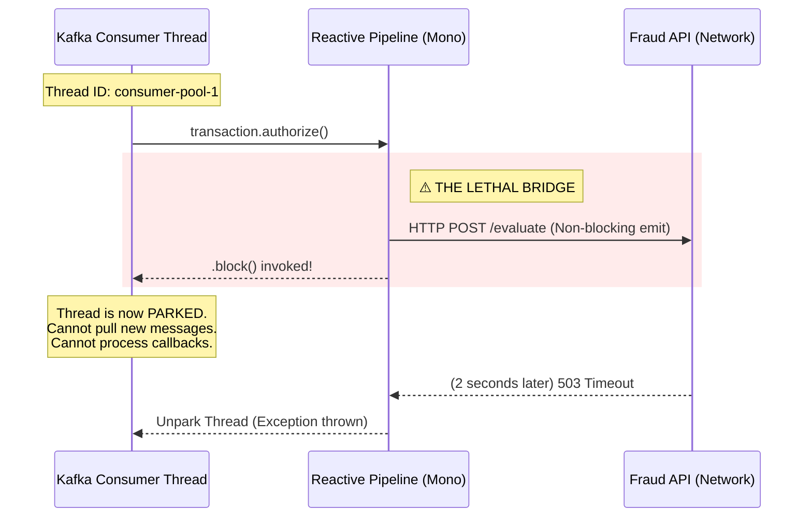

# 🧱 Engineering Brick: The Law of Bounded Execution

> 🌸 *A thousand streams flow swift and free,*
> *Until they meet the frozen sea.*
> *One bounded lock, one silent wait,*
> *And all the rivers seal their fate.*

## 👁️ 1. The Context & The Symptom

In [Part 1](), we explored how a Payment Gateway became a "Zombie"—reporting 100% health while functionally paralyzed. We established that the worker thread pool was entirely exhausted due to a latency spike from a downstream Fraud API. 

But why did the threads freeze so completely? In modern architectures, we heavily utilize asynchronous, non-blocking engines precisely to handle massive concurrency. Yet, this high-speed pipeline collapsed like a house of cards. 

This is the **Concurrency Collapse**: a phenomenon where an ideological collision between a reactive engine and a legacy blocking boundary triggers sudden, systemic thread starvation.

---

## 🌠 2. The Formal Specification (Problem Model)

To understand the freeze, we must map the execution context. 

**The Execution Topology:**
* **The Engine:** A reactive event loop designed to process millions of signals using a tiny number of CPU-bound threads.
* **The Offload:** A bounded worker thread pool handling Kafka ingestion (e.g., 200 concurrent consumer threads).
* **The Collision:** The ingestion threads must invoke a downstream `WebClient` to authorize the transaction. 
* **The Invariant:** A bounded thread pool must never voluntarily surrender its CPU context to wait for network I/O without a strict physical timeout constraint.

---

## 🌪️ 3. The Anatomy of the Collapse (Failure Mode)

The root cause of the starvation was a single, innocuous-looking method call: `.block()`. 

### 📊 3.1 The Reactive Bridge Mismatch

### ⚡ 3.2 The Illusion of Asynchrony
The developers used a highly efficient, non-blocking `WebClient` to make the network call. However, because the Kafka listener framework inherently operated in a synchronous, pull-based loop, they bridged the two worlds by appending `.block()` to the reactive `Mono`.

When you invoke `.block()`, you are taking a thread out of the active compute pool and placing it into a waiting state (I/O sleep). You are paying the complexity tax of a reactive framework while stripping away its fundamental benefit: **thread elasticity**. When the Fraud API stalled, all 200 consumer threads hit the `.block()` wall simultaneously.

---

## ⚖️ 4. The Quantitative Mandate: Little's Law

In distributed systems, concurrency is not a configuration; it is a mathematical consequence of throughput and latency, governed by **Little’s Law**:

`L = λW` 
*(Concurrency = Throughput × Latency)*

Let us apply this to our Payment Gateway:
* **Throughput ($\lambda$):** 1,000 Transactions Per Second.
* **Normal Latency ($W_{normal}$):** 50ms (0.05s).
* **Required Concurrency ($L$):** $1,000 \times 0.05 = \mathbf{50 \text{ Threads}}$.

Under normal conditions, a thread pool of 200 is massive overkill. 

Now, introduce the Fraud API degradation:
* **Degraded Latency ($W_{degraded}$):** 2,000ms (2.0s).
* **Required Concurrency ($L$):** $1,000 \times 2.0 = \mathbf{2,000 \text{ Threads}}$.

The math is brutal and unforgiving. To maintain 1,000 TPS when the downstream system slows to 2 seconds, you physically require 2,000 active threads. Because our pool is hard-capped at 200, the system saturates at 100 TPS, and the remaining 900 transactions pile up in the backlog every second. 

> *The value of Little’s Law here is not perfect prediction, but exposing the mechanical truth: latency spikes instantly convert into concurrency demand.*

---

## ⚡ 5. The Design Dialogue (Socratic Review)

**🕵️ The Challenger**: If Little's Law dictates we need 2,000 threads during a latency spike, why don't we just configure the thread pool `max_size` to 5,000? RAM is cheap.

**🧑‍💻 The Architect**:
RAM is cheap, but Context Switching is not. 5,000 active threads competing for 16 CPU cores will cause severe CPU thrashing. Furthermore, if you allow 5,000 concurrent outbound connections, you will launch a distributed Denial-of-Service (DDoS) attack against the already-struggling Fraud API, ensuring it never recovers. **Thread pools are a bulkhead, not just a processing queue.**

> **🕵️ The Challenger**: What if we upgrade to Java 21 and use Virtual Threads (Project Loom)? Virtual threads are cheap and block without holding OS threads.

**🧑‍💻 The Architect**:
Virtual threads gracefully solve the compute limitation—you will no longer exhaust the OS threads. However, you have only shifted the bottleneck. If you spawn 100,000 virtual threads waiting on a dead API, you will exhaust the memory heap, the connection pool, or the ephemeral port range on the host OS. 
**Virtual threads remove the cost of waiting; they do not remove the cost of what you are waiting on.** You still need isolation boundaries.

---

## 🛡️ 6. System Integrity Boundaries

To cure the Concurrency Collapse, we must enforce strict execution boundaries.

### 6.1 Preserving the Execution Model
If you choose a reactive boundary for downstream I/O, do not collapse it back into synchronous waiting inside the consumer thread. Either preserve non-blocking propagation end-to-end where the framework supports it, or isolate blocking work explicitly behind bounded concurrency.

### 6.2 The Bulkhead & The Hard Timeout
Concurrency limits without strict request timeouts merely delay collapse. You must implement a **Bulkhead** (e.g., a bounded concurrency limit in your stream) protected by an aggressive timeout. **A bulkhead without a hard timeout is merely a slower path to saturation.** When the limit is reached, immediately reject new transactions (Fail Fast) rather than queuing them infinitely.

---

## 🗝 7. The "Brick" Summary (Mental Model)

* **🌠 Signal:** Thread pool saturation, high I/O wait times, and extreme downstream latency.
* **🧩 Structure:** Explicit Bulkheads + Hard Timeouts + Consistent Execution Models.
* **🏛️ Invariant:** Concurrency is mathematically bound to latency. An unbounded wait translates to an infinite concurrency requirement.
* **💠 Pivot Insight:** Asynchronous frameworks do not eliminate latency; they merely shift the bottleneck. A single blocking boundary can bring a highly concurrent pipeline to its knees.

---
🪷 *One sentence to trigger the reflex:* **"You cannot solve an unbounded network delay with a bounded thread pool; if you block the flow, you sink the ship."**
