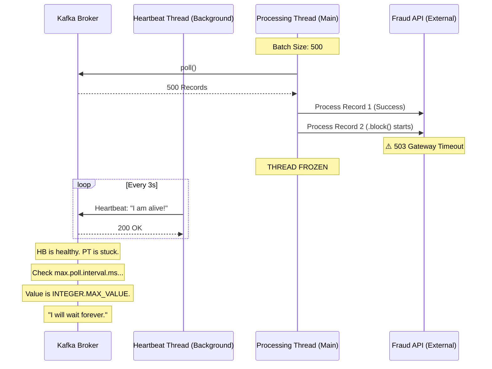

# 🧱 Engineering Brick: The Law of Explicit Leases

> 🌸 *A heartbeat pulses, rhythmic and deep,*
> *While the mind is locked in a frozen sleep.*
> *To grant a lease for all of time,*
> *Is to kill the guard and invite the crime.*

## 🌠 1. The Context & The Symptom

In our previous autopsies, we observed a **Zombie Consumer**: a Payment Gateway pod that was alive to the infrastructure (K8s) but dead to the business. We solved the thread starvation by enforcing timeouts. However, a deeper mystery remains: **Why didn't Kafka’s self-healing mechanism kick in?**

In a healthy distributed cluster, if one worker stops making progress, the group coordinator (Broker) should trigger a **Rebalance**, evicting the delinquent member and redistributing its load. In our case, the Broker stood idly by while 10 million messages accumulated.

This is the **Protocol Trap**: a failure caused by misunderstanding the semantics of distributed leases and heartbeats.

---

## 🧩 2. The Formal Specification (Problem Model)

To solve the mystery, we must define the contract between the Broker and the Consumer.

**The Actors & Protocol:**
* **The Lease (The Promise):** The Consumer promises to return to the Broker and call `poll()` within a specific timeframe (`max.poll.interval.ms`). This is a **Processing Lease**.
* **The Pulse (The Heartbeat):** A separate background thread sends periodic pings (`session.timeout.ms`) to prove the network connection and JVM are still alive.
* **The Goal:** Ensure that any consumer that is either dead (Network/OOM) or stuck (Logic/IO) is removed from the consumer group.

---

## 🌪️ 3. The Anatomy of the Paradox (Failure Mode)

The failure was triggered by an "optimistic" configuration choice meant to solve a different problem: **Infinite Rebalance Loops.**

### 📊 3.1 The Dual-Thread Deception

Since Kafka 0.10.1, the Java client operates two separate threads. This is the root of the "Zombie" state.

### ⚡ 3.2 The `MAX_VALUE` Muzzle
When engineers face "Rebalance Storms" (often caused by large batch sizes taking too long to process), a common but lethal "fix" is to set `max.poll.interval.ms` to `Integer.MAX_VALUE`.

By doing this, you are explicitly telling the Broker: **"Never doubt me. Even if I don't return for days, I am still working."** You have effectively uninstalled the system's autonomic immune response. The Broker sees the Heartbeat thread pinging and the infinite interval, so it assumes everything is fine, while the Partition remains locked by a paralyzed worker.

---

## ⚖️ 4. The Quantitative Mandate: The Rebalance Equation

A Principal Engineer does not guess timeouts; they derive them from the physics of the batch. The `max.poll.interval.ms` must be a function of your worst-case processing time.

**The Variables:**
* **Batch Size ($S$):** 500 records.
* **Hard Timeout per Record ($T_{io}$):** 2 seconds (The circuit breaker limit).
* **Processing Overhead ($O$):** 100ms.

**The Processing Bound ($T_{batch}$):**
$T_{batch} = S \times (T_{io} + O) = 500 \times 2.1s = 1,050 \text{ seconds}$ (~17.5 minutes).

**The Decision Rule:**
`max.poll.interval.ms` must be $> T_{batch} \times \text{Safety\_Factor} (1.5)$.
*Target Value:* $\approx 1,600 \text{ seconds}$.

Setting this to `Integer.MAX_VALUE` (24.8 days) instead of 26 minutes is a **Responsibility Abandonment**. You have traded a 26-minute detection window for a 24-day blackout.

---

## 🔬 5. Socratic Review (The Deep Dive)

> **🕵️ The Challenger**: Why don't we just set `session.timeout.ms` (the heartbeat) to a very small value, like 1 second? That would detect the failure faster.

**🧑‍💻 The Architect**:
That is a category error. `session.timeout.ms` detects **Liveness** (Is the process running?), while `max.poll.interval.ms` detects **Progress** (Is the process working?). Setting a tiny session timeout will cause "Flapping" whenever there is a minor network jitter or a GC pause, triggering unnecessary rebalances that actually *increase* lag. You must separate the pulse from the progress.

> **🕵️ The Challenger**: If large batches are causing rebalances, shouldn't we just increase the interval?

**🧑‍💻 The Architect**:
No. If the interval becomes too long, your "Detection Time" for real failures becomes unacceptable. The correct move is to **reduce the Batch Size**. Processing 50 messages in 1 minute is infinitely safer than processing 500 messages in 10 minutes. Small batches allow for frequent "Check-ins" with the Broker, keeping the system's reaction time sharp.

---

## 🛡️ 6. System Integrity Boundaries

### 6.1 The Explicit Lease Principle
Never use unbounded timeouts in a distributed protocol. Every lease granted (to a thread, a lock, or a consumer) must have a physical expiration based on the maximum tolerable business downtime. **Implicitly trusting a worker is the first step toward a systemic blackout.**

### 6.2 The Batch-Interval Alignment
The `max.poll.records` and `max.poll.interval.ms` are two sides of the same coin. They must be tuned together.
* **Rule:** `Max_Interval > (Batch_Size * Worst_Case_Latency)`.
* If the result is too high for your SLA, you must **decrease the Batch Size**, not increase the Interval.

---

## ✨ 7. The "Brick" Summary (Mental Model)

* **🌠 Signal:** High lag on specific partitions, consumers are "stuck" but pods are not restarting, and no rebalances are occurring.
* **🧩 Structure:** Tight Batch Sizes + Mathematically Derived Poll Intervals + Decoupled Heartbeats.
* **🏛 Invariant:** A distributed lease must be strictly bounded by the maximum tolerable detection delay of a stalled process.
* **💠 Pivot Insight:** Heartbeats prove that the machine is breathing; Poll Intervals prove that the machine is working. If you grant an infinite lease, you disable the system's ability to save itself.

---
🪷 *One sentence to trigger the reflex:* **"Don't confuse a pulse with progress; set a deadline for the work, not just a timeout for the connection."**
