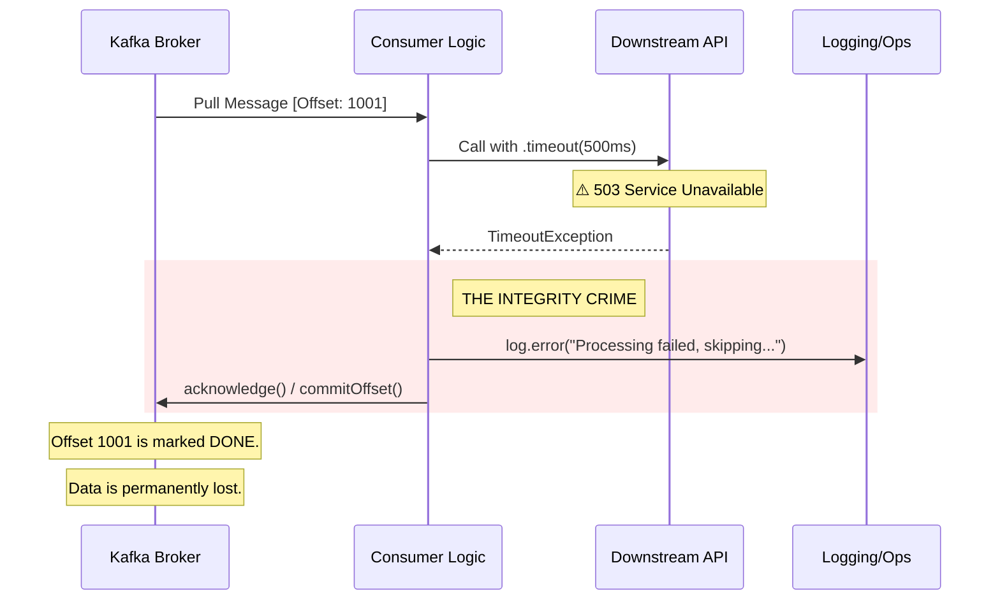

# 🧱 Engineering Brick: The Law of Non-Lossy Recovery

> 🌸 *The river flows without a stain,*
> *But hidden deep is all the grain.*
> *To clear the path by casting wide,*
> *Is but a debt that none can hide.*

## 🌠 1. The Context & The Symptom

In our journey through this autopsy series, we have restored visibility and unlocked frozen threads. The system appears stable. The Kafka lag has vanished. The dashboards are green once more. 

However, a new and more terrifying symptom emerges: **Audit Inconsistency**. The upstream state machine (Event Source) claims it sent 1,000 SKU deletion commands, but the downstream Inventory system only processed 950. There are no errors in the logs. No alerts in the terminal. The 50 missing messages have simply evaporated.

This is the **Integrity Fallacy**: the dangerous belief that a cleared queue is a successful process. This post dissects the "Catch-and-Commit" anti-pattern—the silent killer of data integrity.

---

## 🧩 2. The Formal Specification (Problem Model)

In a distributed event-driven system, we must distinguish between the **Transport Contract** and the **Processing Contract**.

**The Integrity Model:**
* **The Promise:** At-least-once delivery.
* **The Failure Mode:** Transient downstream unavailability (e.g., Fraud API 503).
* **The State Boundary:** Once an offset is committed to the broker, the message is semantically "done."
* **The Global Invariant:** A message offset must never advance unless the payload has reached a terminal state of success OR has been durably persisted in a secondary fault-domain (DLQ).

---

## 🌪️ 3. The Anatomy of Silent Data Loss (Failure Mode)

The most common cause of silent data loss is a "well-intentioned" but architecturally fatal `try-catch` block.

### 📊 3.1 The "Catch-and-Commit" Trap

When the downstream API fails (e.g., 500ms timeout), the code enters the `catch` block. To prevent the "Zombie Consumer" state we discussed in Part 1, the developer adds a timeout and a catch block. But then, they make a fatal choice:

### ⚡ 3.2 The Toil Trap (Human Janitors)
By acknowledging a failed transient error, the developer has inverted the responsibility of the system. Instead of the software managing retries, a **Human Janitor** (Support/SRE) must now manually identify, extract, and re-inject those 50 lost messages. At scale, this "Toil" is more expensive than any infrastructure cost.

---

## ⚖️ 4. The Quantitative Mandate: The Cost of Amnesia

At the Staff level, we measure the **Recovery Toil (RT)** against the **Infrastructure Cost (IC)** of a DLQ.

* **Message Volume:** 10,000,000 messages/day.
* **Failure Rate:** 0.1% (10,000 failures).
* **Manual Recovery Time:** 5 minutes/message (Investigation + Re-injection).
* **Total Toil:** 50,000 minutes ≈ **833 Engineering Hours.**

**The Decision:**
One "clever" catch block cost the company **5.2 engineering months** of manual work for a single day of network instability. Compare this to the cost of a few gigabytes of storage for a Dead Letter Queue. **Architecture is the art of minimizing future toil.**

---

## 🔬 5. Socratic Review (The Deep Dive)

> **🕵️ The Challenger**: Why not just use "Infinite Retries"? If we don't acknowledge the message, Kafka will redeliver it forever until the downstream API recovers.

**🧑‍💻 The Architect**:
Infinite retries lead to **Head-of-Line Blocking (HOL)**. If message #1001 is a "Poison Pill" (a malformed request that will *never* succeed), it will halt your entire partition. **In ordered partitions, one poisoned offset can hold the entire lane hostage.** No other messages can pass. You must move the failure out of the main flow.

> **🕵️ The Challenger**: Is a DLQ always necessary? It adds complexity and another topic to manage.

**🧑‍💻 The Architect**:
Complexity is a trade-off. For non-critical data (e.g., view counts), skipping might be acceptable. But for State-Changing Commands, a DLQ is a mandatory "Safety Valve." It allows you to preserve the **Liveness** of the main pipeline while guaranteeing the **Correctness** of the failed events.

---

## 🛡️ 6. System Integrity Boundaries

### 6.1 The DLQ Mandate (The "Safety Valve")
Every consumer handling critical business state must have an automated fallback topic system.
* **Transient Errors (5xx/Timeout) $\rightarrow$ Retry Topic:** With exponential backoff.
* **Fatal Errors (4xx/Poison Pills) $\rightarrow$ Dead Letter Topic:** For manual inspection.

**The Semantic Rule:** A retry topic is for uncertainty. A dead-letter topic is for irreducible failure.

### 6.2 The Atomic Commit Rule
Never advance the consumer offset *before* the message is durably recorded in the fallback storage. The sequence must be:
1. Try Process.
2. If Fail: Write to Fallback Topic.
3. Commit Ingestion Offset.

*In practice, the exact mechanics depend on the broker/client stack, but the invariant remains: the ingestion offset must not advance before the fallback write is durable.*

---

## ✨ 7. The "Brick" Summary (Mental Model)

* **🌠 Signal:** Lag is zero, but data consistency across systems is breaking. Support teams are manually re-injecting data.
* **🧩 Structure:** Main Topic + Retry Topic (Uncertainty) + DLQ Topic (Irreducible Failure).
* **🏛 Invariant:** A clean queue is not evidence of success; it is only evidence that the pointer moved.
* **💠 Pivot Insight:** Committing a poison pill *after durable isolation* saves the pipeline; committing a timeout *without fallback* betrays the data.

---
🪷 *One sentence to trigger the reflex:* **"A queue with zero lag can still be a crime scene; don't trade your data for a clean dashboard."**
