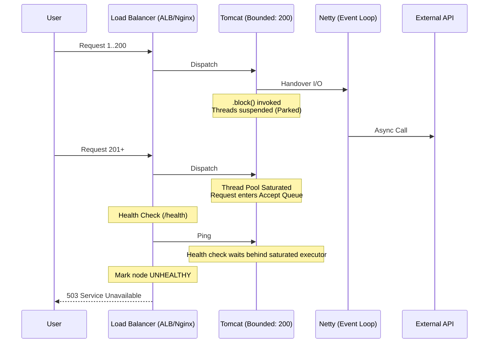

**🧱 Brick: The Hybrid Execution Trap (Thread Starvation via State Suspension)**

🌸 *A synchronous shell hides a reactive core,*
*Where frozen threads wait, and the gateway closes the door.*

## 👁️ 1. Context & Symptom: The Ghost in the Machine

In Tier-1 distributed systems, catastrophic failures often unfold with eerie silence. Your Grafana dashboard shows CPU utilization idling at 5%, the OS memory profile is stable, yet the ingress gateway is flooded with **503 Service Unavailable** and **Connection Refused** errors.

This is not a hardware failure. It is the manifestation of a **Hybrid Execution Trap**: an architectural fracture where a non-blocking engine is embedded within a blocking request model without a formal capacity budget. Welcome to the first autopsy of our series.

## 🚧 2. The Ideological War: The Contagious Reactive Core

The transition from `RestTemplate` to `WebClient` was often driven by the perception that `RestTemplate` was legacy and `WebClient` was the modern default, rather than a holistic shift to Reactive paradigms. In many enterprise codebases, engineers introduced `WebClient` for its elegant Fluent API but were unwilling to refactor the entire call-chain from Controller to Database.

The result is a "makeshift bridge":

```java
public OrderResponse fetchPartnerData() {
    // A reactive blueprint inside an imperative method
    return webClient.get()
                    .uri("/api/v1/valuation")
                    .retrieve()
                    .bodyToMono(OrderResponse.class)
                    .block(); // 🚧 The explicit blocking boundary
}
```

This snippet does not optimize throughput; it merely moves the I/O operation to the Netty event loop while the parent Servlet thread remains suspended, paying the full concurrency cost of the wait.

## ⚖️ 3. Quantitative Mandate: Latency Becomes Thread Demand

To understand why this "bridge" collapses, we must apply **Little's Law** to our concurrency model. 

Assume a standard configuration:
- **Tomcat Worker Threads ($L$):** 200
- **Incoming Traffic:** 500 RPS
- **Partner API Normal Latency ($W_{normal}$):** 100ms
- **Partner API Degraded Latency ($W_{degraded}$):** 5s

Under normal conditions:
$$Capacity = \frac{L}{W} = \frac{200}{0.1s} = 2,000 \text{ RPS}$$

When the downstream dependency degrades to 5 seconds:
$$Capacity = \frac{200}{5s} = 40 \text{ RPS}$$

The math is brutal. The system receives 500 RPS but can only process 40 RPS. The deficit of 460 RPS accumulates in the queue not because the CPU is busy, but because all concurrency slots are waiting. 

**This is why low CPU utilization can be a danger signal: the system is not computing slowly; it is waiting at full capacity.**

> **"Latency does not consume CPU. It consumes concurrency."**

## 🔬 4. Socratic Review

> **🕵️ The Challenger**: But we use `WebClient`. Isn't the HTTP call non-blocking?
>
> **🧑‍💻 The Architect**: The socket may be non-blocking at the transport layer, but the servlet thread is still parked at the application layer. Non-blocking at the client engine does not mean non-blocking at the request model.
>
> **🕵️ The Challenger**: Then should we rewrite the whole service in WebFlux?
>
> **🧑‍💻 The Architect**: Only if the entire boundary can preserve reactive semantics end-to-end. Otherwise, a boring blocking model with explicit timeouts, bulkheads, and possibly virtual threads is significantly easier to reason about and maintain.

## 🌪️ 5. Failure Mode: The Anatomy of Starvation

When `.block()` is invoked, the Servlet thread is **parked** via `LockSupport.park()`. While the CPU is freed, the thread hoards critical physical and logical resources:
- **Memory:** It reserves thread-stack memory (often hundreds of KB to ~1MB depending on JVM configuration and `-Xss`).
- **State:** It may also hold scarce resources such as JDBC connections, transaction contexts, MDC state, or request-scoped objects if those were acquired before the blocking call.

## 🗺️ 6. Blueprint & Topology: The Load Balancer's Guillotine



If health checks share the same saturated servlet executor, even `/health` becomes a victim of thread starvation. The load balancer may eventually evict an otherwise CPU-idle node, triggering a cascading failure.

## 🛡️ 7. System Integrity Boundaries

To prevent a total system collapse, every hybrid bridge must enforce strict defensive fencing:

1.  **Timeout Boundary:** Every blocking bridge must have a hard timeout shorter than the upstream gateway timeout.
2.  **Bulkhead Boundary:** External dependency calls must be protected by a bounded concurrency limiter.
3.  **Health Boundary:** Health checks must not rely only on servlet availability; they must observe in-flight saturation, queue depth, and downstream timeout rates.

## ♙️ 8. Decision Framework: Choosing the Right Boundary

`WebClient.block()` is acceptable only when it is treated as a deliberate blocking boundary with explicit timeout, bulkhead, and capacity sizing—not as a throughput optimization.

| Strategy | Engine | Resource Cost | Best Use Case |
| :--- | :--- | :--- | :--- |
| **WebClient + `.block()`** | Netty + Servlet wait | Hybrid blocking bridge | Transitional code only; must be bounded by timeout/bulkhead. |
| **RestTemplate** | Blocking HTTP client | Imperative | Legacy maintenance. |
| **RestClient** | Blocking abstraction | Imperative | Modern Spring MVC baseline in Spring Boot 3.2+. |
| **RestClient + Loom** | Blocking style on VTs | Lower thread cost; still bounded by sockets, DB pool | High-concurrency I/O with bulkheads. |

## 🏛️ 9. Architectural Doctrine & Invariants

**The Invariant of Explicit Cost:** *An execution model is only scalable when its waiting cost is explicit, bounded, and assigned to the right resource.* A reactive client inside a blocking request model does not make the system non-blocking; it only moves the I/O to another engine while the servlet thread still pays the full concurrency cost of the wait.

## 🗝 10. The "Brick" Summary

* 🌠 **Signal:** Hybrid code using `.block()` without a formal capacity budget.
* 🧩 **Structure:** Servlet threads parked while waiting on an asynchronous I/O boundary.
* 🏛️ **Invariant:** Concurrency is a finite physical resource governed by latency.
* 💠 **Pivot Insight:** Latency does not consume CPU. It consumes concurrency.

***

**A reactive client does not make a blocking architecture reactive. Waiting still has to be budgeted.**
