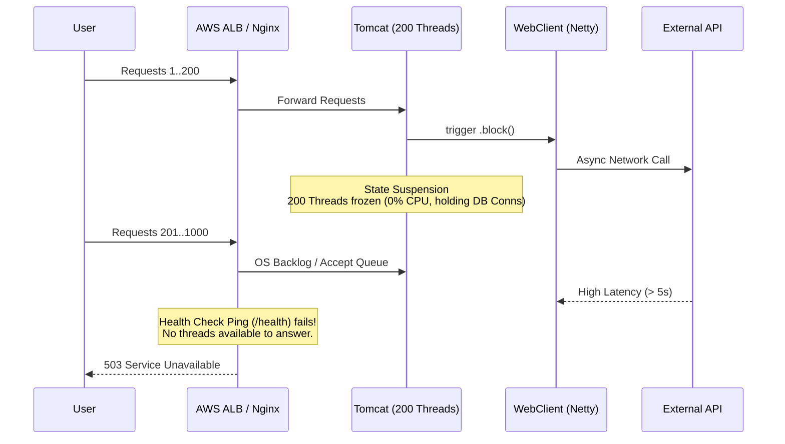

# 🧱 Engineering Brick: The Illusion of Non-Blocking

> 🌸 *A synchronous shell hides a reactive core,*
> *Where frozen threads wait, and the gateway closes the door.*

## 👁️ Context & Symptom: The Silent Catastrophe

In Tier-1 distributed systems, catastrophic failures often unfold silently. No CPU spikes. No Memory alerts on your Grafana control plane. The operating system glides smoothly, yet at the gateway, thousands of customers are stonewalled by instantaneous **503 Service Unavailable** or **Connection Refused** errors.

The root cause is rarely hardware degradation. It stems from a deeply embedded architectural fracture: the forced coupling of two opposing paradigms (Imperative vs. Reactive) and a naive thread-blocking execution.

## 🌑 The Ideological War / Core Confusion

When the Spring Framework pushed `WebClient` as the non-blocking standard, a wave of hype-driven development swept through enterprise teams. Engineering organizations rushed to replace legacy synchronous clients (`RestTemplate`) with Reactive ones.

However, transitioning to Reactive programming is highly contagious. If a downstream external API client returns a `Mono`, the upstream Service and Controller must mutate to accommodate it. Faced with the colossal Coordination Tax of refactoring a massive Legacy Tomcat application, engineers chose an "escape hatch":

```java
public OrderResponse fetchPartnerData() {
    Mono<OrderResponse> blueprint = webClient.get().uri("/api/partner")
                                             .retrieve()
                                             .bodyToMono(OrderResponse.class);
    // 🌑 The hidden death trap
    return blueprint.block();
}
```

The system compiles. Unit tests pass. The Fluent API looks modern. But on Production, this snippet creates a profound space-time rift. It uses an asynchronous engine to solve a synchronous problem, ultimately destroying the elasticity of the system.

## 🌪️ Formal Limits & Physical Constraints: The Anatomy of Starvation

To understand the blast radius of `.block()`, we must define the physical constraints of the JVM.

Tomcat operates on a Thread-per-request model, typically capped at **200 OS Worker Threads**. When 200 concurrent requests reach the Service layer and invoke `.block()`, two physical actions occur:

1. The network blueprint (`Mono`) is delegated to the Netty Event Loop.
2. **State Suspension:** The Tomcat thread invokes `LockSupport.park()`. It freezes.

While blocked, the thread is descheduled from the CPU (consuming 0% CPU cycles). However, it still hoards 1MB of Thread Stack memory and holds onto active JDBC connections. When the 201st user arrives, the OS looks at Tomcat and realizes: *There are no idle workers left.*

## 🗺️ Blueprint & Topology: The Load Balancer's Guillotine



## ⚡ Socratic Review / Design Dialogue

> **🕵️ The Challenger:** *"If all 200 threads are exhausted, request 201 just goes into the OS TCP backlog. It should just experience high latency. Why does the system crash instantly with a 503?"*

**🧑‍💻 The Architect:**
Because the executioner isn't Tomcat. It's the Control Plane - your Load Balancer. While your 200 threads are petrified waiting for the partner API, the AWS ALB periodically pings `/health`. Since no threads are available to answer the ping, the ALB marks the node as UNHEALTHY and evicts it from the routing pool. The system collapses not from computational exhaustion, but because you ran out of the capacity to wait.

## ♟️ Decision Framework & Trade-offs

In a purely Servlet-based environment (Tomcat/Undertow), forcing WebClient via `.block()` yields the worst of both worlds: you pay the cognitive overhead of Reactive Streams without gaining any asynchronous throughput.

| HTTP Client | Underlying Engine | Threading Model | Best Use Case (Spring MVC) |
| :--- | :--- | :--- | :--- |
| **WebClient + `.block()`** | Netty | Hybrid (Fractured) | **Never.** Causes Thread Starvation. |
| **RestTemplate** | Java `HttpURLConnection` | Imperative (Blocking) | Legacy maintenance. |
| **RestClient** *(Spring 3.2+)* | Java 11+ HttpClient | Imperative (Blocking) | Standard Microservices. |
| **RestClient + Virtual Threads** | Java 21+ Project Loom | Zero-cost Unmounting | High-throughput modern systems. |

## 🏛️ Architectural Doctrine & Invariants

**The Law of I/O Consistency:** *A system's I/O model must remain uniform from the edge (Controller) to the core (External Client). You cannot embed a reactive core inside an imperative shell without mapping the latency of external dependencies directly to your thread pool's mortality.*

## 🗝 The "Brick" Summary / Mental Model

* 🌠 **Signal:** Controller returns `DTO`, but the downstream external call uses `WebClient` yielding a `Mono`.
* 🧩 **Structure:** Tomcat OS Threads $\rightarrow$ `.block()` $\rightarrow$ Netty Event Loop.
* 🏛️ **Invariant:** A blocked OS thread is a consumed physical resource, regardless of CPU utilization.
* 💠 **Pivot Insight:** Reactive components inside an imperative shell do not increase throughput; they outsource your system's availability to the latency of external dependencies.

---

**What is the most expensive architectural trade-off you've made to guarantee elasticity across isolated thread pools?**
