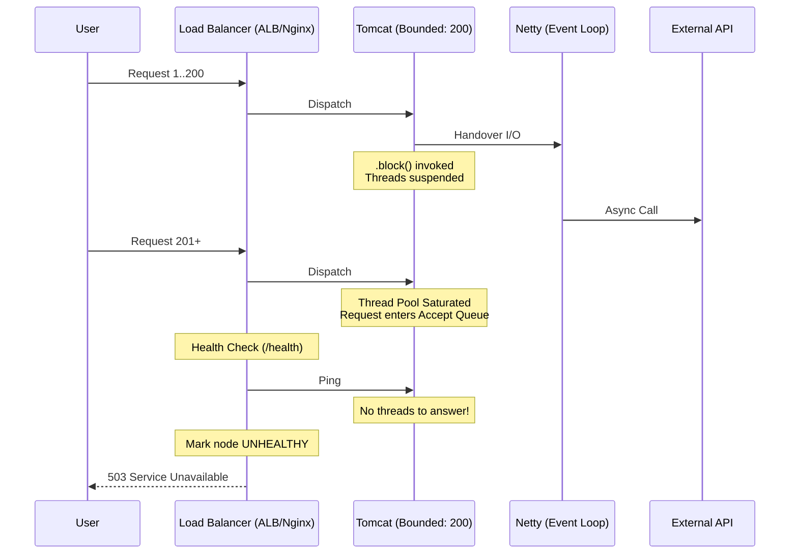

🌸 *A synchronous shell hides a reactive core,*
*Where frozen threads wait, and the gateway closes the door.*

**👁️ Context & Symptom: The Ghost in the Machine**

In Tier-1 distributed systems, catastrophic failures often unfold with eerie silence. Your Grafana dashboard shows CPU utilization idling at 5%, the OS memory profile is stable, yet the ingress gateway is flooded with **503 Service Unavailable** and **Connection Refused** errors.

This is not a hardware failure. It is the manifestation of a **Hybrid Execution Trap**: an architectural fracture where a non-blocking engine is embedded within a blocking request model without a formal capacity budget. Welcome to the first autopsy of our series.

**🌑 The Ideological War: The Contagious Reactive Core**

The transition from `RestTemplate` to `WebClient` was often driven by the "Maintenance Mode" status of legacy tools rather than a holistic shift to Reactive paradigms. In many enterprise codebases, engineers introduced `WebClient` for its elegant Fluent API but were unwilling to refactor the entire call-chain from Controller to Database.

The result is a "makeshift bridge":

```java
public OrderResponse fetchPartnerData() {
    // A reactive blueprint inside an imperative method
    return webClient.get()
                    .uri("/api/v1/valuation")
                    .retrieve()
                    .bodyToMono(OrderResponse.class)
                    .block(); // 🌑 The explicit blocking boundary
}
```

This snippet does not optimize throughput; it merely moves the I/O operation to the Netty event loop while the parent Servlet thread remains suspended, paying the full price of the wait.

**⚖️ Quantitative Mandate: Latency Becomes Thread Demand**

To understand why this "bridge" collapses, we must apply **Little's Law** to our concurrency model. 

Assume a standard configuration:
- **Tomcat Worker Threads ($L$):** 200
- **Incoming Traffic:** 500 RPS
- **Partner API Normal Latency ($W_{normal}$):** 100ms
- **Partner API Degraded Latency ($W_{degraded}$):** 5s

Under normal conditions, our system capacity is:
$$Capacity = \frac{L}{W} = \frac{200}{0.1s} = 2,000 \text{ RPS}$$

When the downstream dependency degrades to 5 seconds:
$$Capacity = \frac{200}{5s} = 40 \text{ RPS}$$

The math is brutal. The system receives 500 RPS but can only process 40 RPS. The deficit of 460 RPS accumulates in the queue not because the CPU is busy, but because all concurrency slots are in a state of **State Suspension**.

> **"Latency does not consume CPU. It consumes concurrency."**

**🌪️ Failure Mode: The Anatomy of Starvation**

When `.block()` is invoked, the Servlet thread calls `LockSupport.park()`. While the CPU is freed, the thread hoards critical physical and logical resources:
- **Memory:** It reserves thread-stack memory (hundreds of KB to ~1MB depending on `-Xss`).
- **State:** It may hold scarce resources such as JDBC connections (if within a `@Transactional` boundary), MDC contexts, or request-scoped beans.

**🗺️ Blueprint & Topology: The Load Balancer's Guillotine**



If health checks share the same saturated servlet executor, even `/health` becomes a victim of thread starvation. The load balancer may eventually evict an otherwise CPU-idle node, leading to a cascading failure across the cluster.

**♙️ Decision Framework: Choosing the Right Boundary**

The use of `.block()` is not inherently "wrong"—it is an explicit blocking boundary. It becomes a failure when treated as a performance optimization.

| Strategy | Engine | Resource Cost | Best Use Case |
| :--- | :--- | :--- | :--- |
| **WebClient + `.block()`** | Netty + Wait | High (Hybrid Tax) | Transitional code; must use strict timeouts & bulkheads. |
| **RestTemplate** | Blocking I/O | High (Linear) | Legacy maintenance with simple blocking needs. |
| **RestClient** | Modern Blocking | High (Linear) | Standard Spring MVC baseline (Spring 3.2+). |
| **RestClient + Loom** | Virtual Threads | **Low (Ephemeral)** | High-concurrency I/O with implicit unmounting. |

**🏛️ Architectural Doctrine & Invariants**

**The Invariant of Explicit Cost:** *An execution model is only scalable when its waiting cost is explicit, bounded, and assigned to the right resource.* A reactive client inside a blocking request model does not make the system non-blocking; it only moves the I/O to another engine while the servlet thread still pays the mortality cost of the wait.

**🗝️ The "Brick" Summary**

* 🌠 **Signal:** Hybrid code using `.block()` without a concurrency budget.
* 🧩 **Structure:** OS Threads locked by an asynchronous handover.
* 🏛 **Invariant:** Concurrency is a finite physical resource governed by latency.
* 💠 **Pivot Insight:** Latency does not consume CPU. It consumes concurrency.

***

**How do you calculate your concurrency budget before deciding between a Reactive or Virtual Threading model?**
