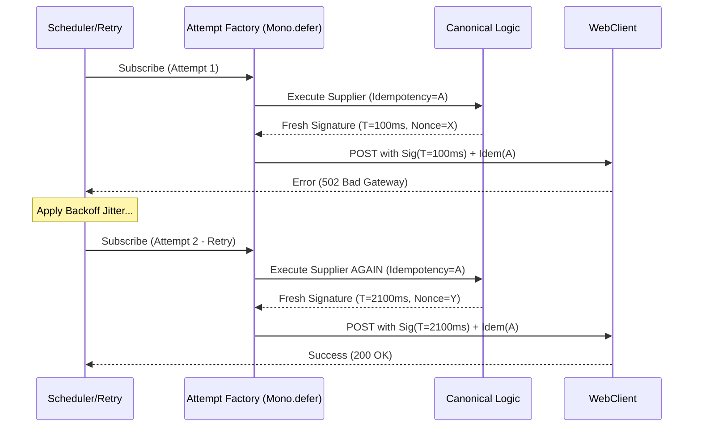

## 🧱 Brick: The Temporal Rift (Assembly vs. Subscription Time)

🌸 *A blueprint drawn in the frost of the past,*
*Execution fails while the old shadows last.*

### 👁️ 1. Context & Symptom: The Persistent 401 Mystery

In our previous autopsy, we examined how hybrid execution models starve the system of concurrency. But even when capacity is strictly budgeted, a more insidious ghost often haunts the logs: **The unfixable 401 Unauthorized during retries.**

The scenario is classic Tier-1 engineering: You call an external gateway that requires a cryptographic signature based on a current timestamp and a nonce. You implement a robust `retryWhen` strategy for network blips. Yet, the logs reveal a baffling pattern:
1. First call fails due to a `502 Bad Gateway` (Transient transport failure).
2. The system retries.
3. Every subsequent retry fails with a **401 Unauthorized**.

You double-check the keys. You verify the HMAC algorithm. Everything is correct. So why is the system essentially DDoS-ing the partner gateway with invalid credentials?

### 🚧 2. The Ideological War: The Sequential Fallacy

The failure stems from a fundamental misunderstanding of how Project Reactor constructs execution pipelines. Engineers transitioning from the Imperative world expect code to execute sequentially as it is read—from top to bottom.

```java
// 🚧 THE HIDDEN TEMPORAL TRAP
public Mono<OrderResponse> callPartner(String payload) {
    String timestamp = String.valueOf(System.currentTimeMillis());
    String signature = hmacSign(payload, timestamp); // Evaluated instantly

    return webClient.post()
        .header("X-Timestamp", timestamp)
        .header("X-Signature", signature)
        .bodyValue(payload)
        .retrieve()
        .bodyToMono(OrderResponse.class)
        .retryWhen(retryTransientOnly());
}
```

In the eyes of a Systems Architect, this code is a **Temporal Fracture**. The timestamp and signature are calculated **once** when the `Mono` is being built. The `retryWhen` operator does not re-invoke the `callPartner` Java method; it merely re-subscribes to the *Publisher* returned by the method.

The system is trying to authenticate with a signature that expired three retries ago.

### 🌠 3. Formal Specification: Assembly vs. Subscription Time

To master Reactive flows, one must delineate between two absolute planes of existence:

**A. Assembly Time (The Blueprint)**
This is when you define the topology of the pipeline. Operators are wired together. In the flawed example above, the `signature` is a captured, constant string by the time the pipeline is constructed.

**B. Subscription Time (The Flow)**
This is when a consumer opens the valve, and data (or execution) actually begins. Only code wrapped inside a lazy boundary (like a `Supplier` or `Mono.defer`) executes at this exact moment.

### 🔧 4. Corrected Pattern: Mono.defer as an Attempt Factory

To heal the temporal rift, we must align the lifecycle of our temporal state with the execution attempt. `Mono.defer()` acts as an **attempt factory**. Every subscription constructs a fresh request context.

However, we must strictly separate *Temporal Identity* from *Business Identity*:

```java
public Mono<OrderResponse> callPartner(String payload) {
    // 1. BUSINESS IDENTITY: Stable across all retries
    String idempotencyKey = UUID.randomUUID().toString();

    // 2. THE ATTEMPT FACTORY: Re-evaluated on every subscription/retry
    return Mono.defer(() -> {
        // TEMPORAL IDENTITY: Fresh per attempt
        String timestamp = String.valueOf(System.currentTimeMillis());
        String nonce = UUID.randomUUID().toString();
        String bodyHash = sha256(payload);
        
        // Atomic generation of the canonical request
        String signature = hmacSign(payload, timestamp, nonce, bodyHash);

        return webClient.post()
                .uri("/api/v1/valuation")
                .header("X-Timestamp", timestamp)
                .header("X-Nonce", nonce)
                .header("X-Signature", signature)
                .header("Idempotency-Key", idempotencyKey)
                .bodyValue(payload)
                .retrieve()
                .bodyToMono(OrderResponse.class);
    }).retryWhen(retryTransientOnly());
}
```

### ⚡ 5. The Design Dialogue (Socratic Review)

> **🕵️ The Challenger**: Why can't I just move the signature logic inside a `.map()`?
>
> **🧑‍💻 The Architect**: A `.map()` after `retrieve()` is too late; the request has already been built and sent. What matters is not the operator name; what matters is whether the signing logic is inside the subscription path *before* request construction.

> **🕵️ The Challenger**: What if I just use a `Supplier` for the header value dynamically?
>
> **🧑‍💻 The Architect**: Lazy header suppliers can work only if the entire canonical request—timestamp, nonce, body hash, and signature—is generated atomically for the same attempt. Updating only one header lazily while the rest of the request context is captured is a consistency trap.

> **🕵️ The Challenger**: If every retry gets a new signature, should every retry also get a new Idempotency Key?
>
> **🧑‍💻 The Architect**: Absolutely not. Security identity and business idempotency have opposite lifetimes. The signature must be fresh per attempt to satisfy the transport's security perimeter; the idempotency key must remain stable across attempts to guarantee exactly-once business semantics.

### 🛡️ 6. System Integrity Boundaries

To ensure resilient and secure integrations, hybrid architectures must enforce the following boundaries:

1. **Attempt Context Boundary:** The timestamp, nonce, body hash, and signature must be generated atomically inside the same lazy attempt factory.
2. **Retry Classification Boundary:** Retry *only* transient transport failures (e.g., 5xx, timeouts, connection resets). Never blindly retry `401 Unauthorized` or `403 Forbidden`. A failed signature will not magically fix itself without state regeneration.
3. **Idempotency Boundary:** If the request carries state mutations, the idempotency key must remain stable across retries, while the authentication signature must be regenerated per attempt.

### 🗺️ 7. Blueprint & Topology: The Lifecycle of a Retry



### ♟️ 8. Decision Framework: Evaluation Momentum

| State Type | Component | Evaluation Moment | Lifecycle Scope |
| :--- | :--- | :--- | :--- |
| **Pipeline Topology** | Operators (`map`, `retryWhen`) | Assembly Time | Global |
| **Business Identity** | Idempotency Key, Trace ID | Assembly Time (Pre-defer) | Request Lifecycle |
| **Security Identity** | Signature, Timestamp, Nonce | Subscription Time (`defer`) | Attempt Lifecycle |
| **Fallback State** | Cached Data, Defaults | Subscription Time (`onErrorResume`) | Failure Lifecycle |

### 🏛️ 9. Architectural Doctrine & Invariants

**The Law of Evaluation Postponement:** *Temporal state must live at the same lifecycle boundary as the execution attempt.* In a distributed system, a retry is a new execution attempt, not a replay of old identity. If your identification token is tethered to a fixed point in Assembly Time, your resilience strategy is physically incompatible with your security policy.

### 🗝 The "Brick" Summary

* 🌠 **Signal:** `401 Unauthorized` errors occurring exclusively during retries.
* 🧩 **Structure:** Dynamic state inside `Mono.defer()`; static state outside.
* 🏛️ **Invariant:** Subscription triggers re-evaluation; Assembly triggers wiring.
* 💠 **Pivot Insight:** A retry is a new execution attempt, not a new business operation. Refresh temporal identity, preserve business idempotency.

***

**Are your resilience mechanisms replaying stale context, or are they truly manufacturing fresh execution attempts?**
