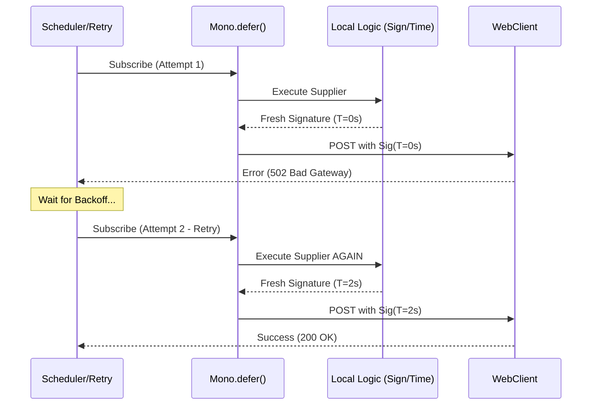

## 🧱 Brick: The Temporal Rift (Assembly vs. Subscription Time)

🌸 *A blueprint drawn in the frost of the past,*
*Execution fails while the old shadows last.*

### 👁️ 1. Context & Symptom: The Persistent 401 Mystery

In our previous autopsy, we examined how `.block()` starves the system of concurrency. But even when the system is not starved, a more insidious ghost often haunts the logs: **The Unfixable 401 Unauthorized during Retries.**

The scenario is classic Tier-1 engineering: You call an external gateway (like FGW or IQS) that requires a cryptographic signature based on a current timestamp. You implement a robust `retryWhen` strategy for network blips. Yet, the logs reveal a baffling pattern:

1. First call fails due to a 502 Bad Gateway (Transient).
2. The system retries.
3. Every subsequent retry fails with **401 Unauthorized**.

You double-check the keys. You verify the algorithm. Everything is correct. So why is the system "DDoS-ing" itself with invalid credentials?

### 🚧 2. The Ideological War: The Sequential Fallacy

The failure stems from a fundamental misunderstanding of how Project Reactor works. Engineers coming from the Imperative world expect code to execute sequentially as it is read - from top to bottom.

```java
public Mono<String> callPartner(String payload) {
    String timestamp = String.valueOf(System.currentTimeMillis());
    String signature = hmacSign(payload, timestamp); // Generated at Assembly Time

    // 🚧 The hidden temporal trap
    return webClient.post()
        .header("X-Timestamp", timestamp)
        .header("X-Signature", signature)
        .bodyValue(payload)
        .retrieve()
        .bodyToMono(String.class)
        .retryWhen(Retry.max(3));
}
```

In the eyes of architecture, this code is a **Temporal Fracture**. The timestamp and signature are calculated **once** when the `Mono` is being built (Assembly Time). When the `retryWhen` operator triggers a re-subscription, it does not re-execute the method; it merely re-subscribes to the *already built* pipeline.

The system is trying to enter a house with a key that expired three retries ago.

### 🌠 3. Formal Specification: The Two Dimensions of Time

To master Reactive flows, one must distinguish between two absolute planes of existence:

**A. Assembly Time (The Blueprint)**
This is when you define the "pipes" and "filters." Operators like `map`, `flatMap`, and `retryWhen` are wired together. In the flawed example above, the `signature` is a constant string by the time the pipeline is constructed.

**B. Subscription Time (The Flow)**
This is when a consumer opens the valve. The data starts flowing. Only code inside a `Supplier` or a lazy operator executes at this exact moment.

**The Constraint:** Any state that depends on the exact moment of execution (Timestamps, Nonces, Signatures) **must** be evaluated at Subscription Time, not Assembly Time.

### ⚡ 4. The Design Dialogue (Socratic Review)

> **🕵️ The Challenger**: Why can't I just move the signature logic inside a `.map()`?

**🧑‍💻 The Architect**:
Because `.map()` operates on the *result* of the flow. You need the signature *before* the request is even sent. You are trying to paint the car while it is already driving.

> **🕵️ The Challenger**: What if I just use a fresh timestamp inside the header producer?

**🧑‍💻 The Architect**:
If you use a `Supplier` for the header value, it might work for some clients, but it breaks the **Immutability Invariant** of the request specification. The most reliable and conceptually sound way is to re-manufacture the entire request context for every attempt.

### 🗺️ 5. Blueprint & Topology: Healing the Rift with `Mono.defer`

`Mono.defer()` acts as a "Womb of Rebirth." It takes a `Supplier` that returns a `Mono`. Every time a subscription (or a retry) occurs, the `Supplier` is invoked entirely from scratch.



### ♟️ 6. Decision Framework: Choosing the Right Evaluation Moment

| Scenario | Strategy | Evaluation Moment |
| :--- | :--- | :--- |
| **Static Configuration** | Standard `Mono` | Assembly Time |
| **Idempotent Keys** | Variable outside `defer` | Assembly Time (Shared across retries) |
| **Security Signatures** | `Mono.defer()` | **Subscription Time** (New per retry) |
| **Dynamic URL Routing** | `Mono.defer()` | **Subscription Time** (Late binding) |

### 🏛️ 7. Architectural Doctrine & Invariants

**The Law of Evaluation Postponement:** *Logic bound to the volatility of time or identity must be lazily evaluated at the edge of execution.* In a distributed system, a retry is not just a "repeat"; it is a **Re-identification**. If your identification token (Signature) is tethered to a fixed point in time, your resilience strategy (Retry) is physically incompatible with your security policy.

### 🗝 The "Brick" Summary

* 🌠 **Signal:** 401 Unauthorized errors occurring exclusively during retries.
* 🧩 **Structure:** `Mono.defer(() -> { ... temporal logic ... }).retryWhen(...)`
* 🏛️ **Invariant:** Subscription triggers re-evaluation; Assembly triggers wiring.
* 💠 **Pivot Insight:** A retry is a rebirth. If the signature is dead, the retry will be stillborn.

***

**How do you audit your reactive pipelines to ensure that no "frozen" state is leaking into your resilience boundaries?**
