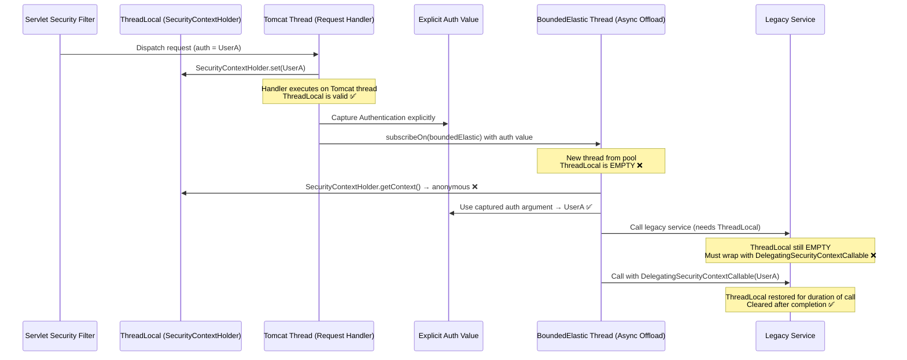

## 🧱 Engineering Brick: The Context Propagation Collapse (Identity Dissociation Across Scheduler Hops)

🌸 *A token proves who spoke at the door,*
*But identity dissolves at the reactor floor.*

### 👁️ 1. Context & Symptom: The Authenticated Anonymous

Our previous autopsies exposed two distinct failure modes of hybrid architectures. Part 1 revealed the Concurrency Illusion: a thread pool silently saturated while CPU idles at 5%. Part 2 revealed the Temporal Rift: a retry pipeline re-sending an expired signature it believed was fresh. Both failures were, in their own way, dramatic—503s flooded the load balancer; 401s appeared in the logs with unmistakable regularity.

This third failure is of a different character entirely. **It fails silently, with no exception, no error log, and no non-2xx response.** The system processes the request, commits the mutation to the database, and returns 200 OK. The user sees success. The operation completes.

And yet, downstream, the wrong identity was used.

The symptom surfaces under a specific and common set of conditions: a Spring Boot application that mixes Spring MVC (Tomcat) with reactive components—`WebClient`, `Mono`, `Flux`, `@Async` methods, or reactive stream operators. Authentication is handled by Spring Security. Integration tests and staging environments show green. Then production reveals:

- Audit logs record operations attributed to `anonymous` despite confirmed JWT authentication at the gateway.
- `@PreAuthorize` expressions inside `@Async` methods execute against an empty `SecurityContext`. Spring Security resolves the missing authentication as `AnonymousAuthenticationToken`, causing expressions like `isAuthenticated()` or `hasRole('USER')` to throw `AccessDeniedException`—a visible failure. The more insidious case is the residual-context scenario: the expression evaluates successfully against the wrong user's identity, producing an authorization decision that is technically valid but semantically corrupt.
- Downstream service-to-service calls carry no user principal in the MDC trace, creating correlation gaps in Datadog, Jaeger, or Dynatrace.
- In a multi-tenant system, a `flatMap` that branches into `Schedulers.boundedElastic()` occasionally reads a residual `ThreadLocal` from a prior request—attributing a Tenant A operation to Tenant B's identity.

No stack trace. No `ClassCastException`. No observable signal from the request path. The failure is structurally invisible unless you instrument specifically for it.

### ☯️ 2. The Ideological War: Two Models of Carrying State Across Time

The root cause is not a bug in Spring Security or Project Reactor. It is an architectural impedance mismatch between two fundamentally incompatible models of propagating state across the execution timeline of a request.

**The ThreadLocal Model (Imperative):**
`SecurityContextHolder` uses a `ThreadLocal<SecurityContext>` by default. The security context is bound to the executing thread for the lifetime of that thread's participation in the request. In the classical Tomcat thread-per-request model, this contract is airtight: the same thread handles the entire request lifecycle—filter chain, controller, service, repository—so the security context is always reachable wherever `SecurityContextHolder.getContext()` is called.

**The Reactor Context Model (Reactive):**
Project Reactor propagates state through its own `ContextView`, passed downstream through the operator chain at subscription time. This propagation is independent of which physical thread executes any given operator. A single logical reactive pipeline may execute across a Netty I/O thread, a `parallel` scheduler thread, and a `boundedElastic` worker thread within a single user request.

The trap opens the moment these two models are mixed without an explicit bridge:

```java
// ❌ THE HIDDEN TRAP: ThreadLocal identity evaporates at the scheduler boundary
public Mono<AuditRecord> recordOperation(String operation) {
    // Reads ThreadLocal ONCE, on the calling thread, at assembly time
    Authentication auth = SecurityContextHolder.getContext().getAuthentication();

    return Mono.fromCallable(() -> {
                // This lambda executes on Schedulers.boundedElastic() — a different thread
                // The ThreadLocal is EMPTY here; auth was only captured above by coincidence
                return buildAuditRecord(auth, operation);
            })
            .subscribeOn(Schedulers.boundedElastic());
}
```

The betrayal here is complete and deceptively quiet. When `auth` is captured before the `subscribeOn`, the code appears to work—but `auth` is a snapshot frozen at the moment the `Mono` was assembled, not at the moment it was subscribed. If the calling thread's security context is later updated, mutated, or cleared, the captured value diverges from reality. And if no capture occurs at all—if the code tries to call `SecurityContextHolder.getContext()` *inside* `Mono.fromCallable`—it returns `null` deterministically on every scheduler hop.

### 📊 3. Quantitative Mandate: Thread Hops and the Determinism of Loss

In a purely imperative Tomcat model, a request executes on exactly **one thread** from ingress to egress. The ThreadLocal context survival probability is:

$$P(\text{ThreadLocal survives}) = 1.0$$

In a hybrid reactive model under production load, a single logical request may traverse:
- **1 Netty I/O thread** — incoming connection handling or WebClient response callback
- **N parallel scheduler threads** — when `flatMap` is invoked with `concurrency > 1`
- **M boundedElastic worker threads** — for any blocking I/O offloaded via `subscribeOn(Schedulers.boundedElastic())`

Each of these transitions is a scheduler boundary. ThreadLocal is thread-scoped. A scheduler boundary changes the executing thread. For any pool-based scheduler—which is the production default—the outcome is structurally determined, not probabilistic:

$$P(\text{ThreadLocal survives} \mid \text{hop to pooled thread}) = 0$$

A pooled thread does not inherit the `ThreadLocal` of the thread that submitted the work. The only remaining question is whether the code accidentally reads a stale snapshot *before* the hop (giving an outdated identity, still wrong) or attempts to read *after* it (returning `null` or an `AnonymousAuthenticationToken`).

> **"Every scheduler hop is a context boundary. ThreadLocal does not cross boundaries. Reactor Context does."**

### 🛠️ 4. The Corrected Pattern: Explicit Context Transport

Healing the context propagation collapse requires choosing the correct carrier at each execution boundary. In a pure WebFlux application, that carrier is Reactor `Context`. In a Spring MVC application that merely uses reactive components internally, the carrier is often an explicit method argument or a Spring Security delegating wrapper. Treating these as the same architecture is how the failure re-enters through the side door.

**Layer 1: In Spring MVC hybrids, capture identity explicitly before the scheduler hop.**

A common misconception in hybrid applications is that a `WebFilter` can serve as the bridge. `WebFilter` belongs to the WebFlux (reactive) stack and operates on `ServerWebExchange`. In a Spring MVC (Servlet) application, the filter chain is imperative, and there is no ambient Reactor `Context` to write into at the filter boundary.

The correct bridge for a Spring MVC + WebClient hybrid is to capture authentication *at the point where the reactive pipeline is initiated*--while the request is still executing on the trusted Servlet thread--and then pass it explicitly across the async boundary:

```java
public Mono<AuditRecord> recordOperation(String operation) {
    // Capture on the calling Tomcat thread. This is the last point where
    // SecurityContextHolder is a valid source of request identity.
    Authentication auth = SecurityContextHolder.getContext().getAuthentication();
    if (auth == null) {
        return Mono.error(new AuthenticationCredentialsNotFoundException("No security context"));
    }
    return Mono.fromCallable(() -> buildAuditRecord(auth, operation))
               .subscribeOn(Schedulers.boundedElastic());
}
```

This is not magic propagation. It is explicit transport: identity becomes a value carried into the lambda, not an ambient property discovered from a pooled worker thread.

**Layer 2: In pure WebFlux, read from Reactor Context, not ThreadLocal.**

For a pure WebFlux application, `ReactiveSecurityContextHolder` is the correct entry point. Spring Security's reactive support writes authentication into Reactor `Context` when using the reactive security stack; operators should retrieve identity from Reactor `Context`, not from `SecurityContextHolder`:

```java
public Mono<AuditRecord> recordOperation(String operation) {
    return ReactiveSecurityContextHolder.getContext()
            .map(SecurityContext::getAuthentication)
            .flatMap(auth ->
                    Mono.fromCallable(() -> buildAuditRecord(auth, operation))
                        .subscribeOn(Schedulers.boundedElastic())
            );
}
```

The authentication is now retrieved from Reactor `Context`--which propagates through the operator chain--rather than from a `ThreadLocal` that will be empty on the `boundedElastic` thread.

**Layer 3: Bridge back to ThreadLocal for legacy imperative services using a delegating wrapper.**

When a reactive pipeline must call a legacy imperative service that internally reads `SecurityContextHolder`, the execution must be wrapped so that the ThreadLocal is restored inside the delegated scope:

```java
public Mono<Result> callLegacyService(Authentication auth) {
    Callable<Result> securedCall = new DelegatingSecurityContextCallable<>(
            () -> legacyService.doWork(),
            new SecurityContextImpl(auth)
    );
    return Mono.fromCallable(securedCall)
               .subscribeOn(Schedulers.boundedElastic());
}
```

`DelegatingSecurityContextCallable` installs the provided `SecurityContext` into the `SecurityContextHolder` for the duration of the delegated `Callable`, then clears it—preventing the residual context leak that causes the multi-tenant identity swap.

**Layer 4: Bridge MDC trace context at blocking boundaries using `contextCapture()`.**

For trace propagation across `subscribeOn` hops, Reactor 3.5.3+ with Micrometer Tracing provides `contextCapture()`, which instructs the framework to capture the current `Observation` and re-apply it at subscription time:

```java
return Mono.deferContextual(ctx -> {
            String traceId = ctx.getOrDefault("traceId", "unset");
            MDC.put("traceId", traceId);
            return Mono.fromCallable(() -> legacyService.doWork());
        })
        .subscribeOn(Schedulers.boundedElastic())
        .contextCapture();
```

### ⚡ 5. Socratic Review

> **🕵️ The Challenger**: We only use Spring MVC with `RestTemplate`. How can we possibly have this problem?
>
> **🧑‍💻 The Architect**: The moment you introduce `WebClient`, `@Async`, `CompletableFuture.supplyAsync`, or any `ExecutorService` call inside a Spring MVC handler, you have created a thread boundary. The security context does not follow. Spring Security's `DelegatingSecurityContextExecutorService` exists precisely because this problem is endemic even in purely imperative codebases.

> **🕵️ The Challenger**: We always call `SecurityContextHolder.getContext()` at the very top of the method, before any async work. That should be safe.
>
> **🧑‍💻 The Architect**: It captures a snapshot at that instant, on that thread. Whether the snapshot is valid depends entirely on whether the calling thread was the original request thread with a populated context. If the method is invoked from an `@Async` pool, a `CompletableFuture`, or a reactive scheduler—even indirectly—the capture happens on a thread with an empty context. "Top of the method" provides no guarantee when the method itself runs on the wrong thread.

> **🕵️ The Challenger**: Can we solve this by switching `SecurityContextHolder` to `MODE_INHERITABLETHREADLOCAL`?
>
> **🧑‍💻 The Architect**: That mode causes child threads spawned via `Thread` or Spring's `TaskExecutor` to inherit the parent's `ThreadLocal`. It does not help with Netty I/O threads, reactive schedulers, or any externally managed thread pool that does not inherit from the request thread. It is a partial fix that eliminates one class of failures while leaving the reactive class entirely unaddressed—and worse, it may create a false sense of security that delays discovery of the deeper structural gap.

> **🕵️ The Challenger**: What about Java 21 virtual threads? Does Project Loom solve this?
>
> **🧑‍💻 The Architect**: Virtual threads still use `ThreadLocal` semantics. Each virtual thread has its own `ThreadLocal` scope and does not inherit across scheduler or executor boundaries. The correct long-term direction is `ScopedValue`, finalized in JEP 506 as part of JDK 25, designed for structured concurrency. It propagates values through a lexically scoped execution tree rather than binding them to thread identity—eliminating the inheritance problem entirely. For production hybrid codebases on current LTS JDKs, the Reactor Context bridge pattern remains the correct immediate fix.

### 🪞 6. Failure Mode: The Multi-Tenant Identity Swap

The most severe production manifestation of this failure occurs in multi-tenant systems where `boundedElastic` threads are pooled and reused across requests.

Consider two concurrent requests: one for Tenant A, one for Tenant B. Both branch into `Schedulers.boundedElastic()`. Tenant A's branch executes on Thread-7. It writes a residual `ThreadLocal` value—perhaps via a misconfigured legacy adapter—without clearing it afterward. Tenant B's subsequent request is dispatched to Thread-7 (now idle and returned to the pool). Before Thread-7 has any opportunity to initialize a new context, Tenant B's code reads the ThreadLocal and finds Tenant A's residual identity:

```
Thread-7 [BoundedElastic-pool] → served Tenant A → ThreadLocal: tenantId=A (not cleared)
Thread-7 [BoundedElastic-pool] → now serving Tenant B → reads ThreadLocal → tenantId=A ❌
Tenant B operation is committed under Tenant A's identity → data leakage
```

This failure is not a classical race condition. It is a **context residue leak**: a pooled thread silently carries the prior owner's identity into the next request. It is load-dependent (occurs only when threads are heavily reused), intermittent (depends on scheduling order), and virtually undetectable without explicit context validation assertions inserted into the pipeline entry points of every `subscribeOn` boundary.

The defense is strict: every `subscribeOn` boundary that executes with tenant-sensitive state must use `DelegatingSecurityContextCallable` or an equivalent mechanism that both *installs* the correct context before execution and *clears* it unconditionally after—whether the callable succeeds, fails, or is cancelled.

### 🗺️ 7. Blueprint & Topology: The Context Lifecycle Across Thread Boundaries



### ⛩️ 8. System Integrity Boundaries

Every application mixing Spring Security with reactive or asynchronous execution must enforce the following context propagation contracts as non-negotiable invariants:

1. **Entry Boundary:** In Spring MVC hybrids, capture authentication explicitly while still on the Servlet request thread. In pure WebFlux, rely on Spring Security's reactive context and `ReactiveSecurityContextHolder`. Do not assume a Servlet filter can write into an ambient Reactor `Context` that does not exist yet.
2. **Scheduler Boundary:** Any `subscribeOn()` or `publishOn()` that transfers execution to a non-request thread must be treated as a hard context isolation point. Reactor `Context`, explicit arguments, or delegating wrappers are safe carriers; ambient `ThreadLocal` reads are not.
3. **Legacy Service Boundary:** Calls to imperative services that internally read `SecurityContextHolder` must be wrapped with `DelegatingSecurityContextCallable` or `DelegatingSecurityContextExecutorService`. This wrapper both installs the correct context and guarantees cleanup.
4. **Audit Boundary:** Audit log entries must derive user identity from Reactor Context or from explicitly propagated method parameters. Ambient `ThreadLocal` reads inside async closures are not a reliable source of truth.
5. **Thread Pool Cleanliness Boundary:** Any custom `ThreadPoolTaskExecutor` used by `@Async` must be configured with a `DelegatingSecurityContextAsyncTaskExecutor` decorator to prevent context residue across task invocations.
6. **Test Boundary:** Integration tests must simulate context propagation across scheduler hops explicitly. Testing a method only on the JUnit thread—where the calling thread happens to be the context thread—provides false confidence about production behavior under a reactive or `@Async` execution model.

### 🧭 9. Decision Framework: Context Carrier Selection

| Execution Context | Correct State Carrier | ThreadLocal Survives? | Risk If Wrong |
| :--- | :--- | :--- | :--- |
| **Tomcat Request Thread** | `SecurityContextHolder` (ThreadLocal) | ✅ Yes, same thread | None--until thread boundary is crossed |
| **Spring `@Async` (TaskExecutor)** | `DelegatingSecurityContextAsyncTaskExecutor` | ⚠️ Only with delegation wrapper | Identity loss in async tasks; visible denial or wrong-user authorization if residual context leaks |
| **`CompletableFuture.supplyAsync`** | `DelegatingSecurityContextCallable` | ❌ No | Anonymous identity in async callbacks |
| **Reactor `subscribeOn` / `publishOn`** | Reactor `ContextView` + `ReactiveSecurityContextHolder` | ❌ No | Silent auth failure; wrong principal in audit log |
| **Netty I/O Thread** | Reactor `ContextView` only | ❌ No | Security context always null; silent anonymous execution |
| **Spring MVC `Mono.fromCallable` + `boundedElastic`** | Explicit auth argument, or `DelegatingSecurityContextCallable` for legacy code | ❌ No (unless wrapped) | MDC loss; trace gaps; multi-tenant identity swap |
| **Virtual Threads (JDK 21+)** | ThreadLocal per-VT (correct for now); `ScopedValue` (JEP 506 / JDK 25, preferred long-term) | ⚠️ Scoped to each VT | Context isolation across executor boundaries; `ScopedValue` eliminates the inheritance problem at the language level |

### 🏛️ 10. Architectural Doctrine & Invariants

**The Law of Explicit Context Transport:** *In any system where execution crosses thread boundaries, identity and observability state must be transported explicitly. Implicit ambient state—ThreadLocal, static fields, or any thread-scoped store—is an undeclared dependency on thread identity. It breaks deterministically at every scheduler hop and silently at every thread pool reuse.*

The consequence for hybrid architectures is precise and unambiguous. ThreadLocal is a valid carrier for exactly the duration and scope of the thread that wrote it. The moment execution is transferred—via `subscribeOn`, `@Async`, `CompletableFuture.supplyAsync`, or any raw `ExecutorService` submission—the ThreadLocal world ends.

Reactor Context is not merely "the reactive alternative to ThreadLocal." In a reactive stack, it is the semantically correct carrier for state that must survive asynchronous, multi-threaded operator chains. It is propagated by the framework through the subscription hierarchy, independent of which physical thread executes any given operator. Unlike manually installed `ThreadLocal` state, Reactor `Context` itself is scoped to the subscription rather than to pooled thread reuse. Any bridge back into MDC or `SecurityContextHolder`, however, must still perform disciplined installation and cleanup.

The hybrid architecture failure is not that these two models exist. They exist for good reasons—ThreadLocal is fast, low-overhead, and ergonomic for synchronous request scopes. The failure is the assumption that they compose transparently. They do not. Every boundary where imperative and reactive models meet requires an explicit, deliberate, and tested bridge.

**What makes this failure uniquely dangerous** is not its severity in any single occurrence—it is its invisibility. Thread starvation produces 503 errors. The temporal rift produces 401 errors. Context propagation collapse produces **200 OK with corrupted identity**. The system appears healthy. Monitoring shows green. The damage accumulates silently in audit logs, authorization decisions, and—at worst—multi-tenant data records, until a compliance review or a security incident makes the invisible visible.

### 🗝️ The "Brick" Summary

* 🌠 **Signal:** Audit logs recording `anonymous` despite valid authentication; async authorization decisions evaluating against anonymous or residual identity; MDC trace IDs missing across `subscribeOn` boundaries; intermittent multi-tenant data attribution errors.
* 🧩 **Structure:** Spring MVC hybrids capture authentication explicitly before scheduler hops; pure WebFlux chains retrieve identity via `ReactiveSecurityContextHolder.getContext()`; legacy service calls are wrapped with `DelegatingSecurityContextCallable`; MDC bridge uses `contextCapture()` + `deferContextual()` with explicit cleanup discipline.
* 🏛️ **Invariant:** ThreadLocal does not cross scheduler boundaries. Reactor Context does. Every thread boundary is a hard context isolation point, not a transparent continuation.
* 💠 **Pivot Insight:** The security context did not disappear—it was never transported. Successful authentication at the gateway does not propagate identity downstream. In hybrid systems, identity is not ambient state. It is an explicit payload that must be carried across every execution boundary by a carrier designed for that purpose.

---

**Authentication proves who you are at the door. Context propagation is the separate contract that ensures the system still knows who you are three scheduler hops later.**
